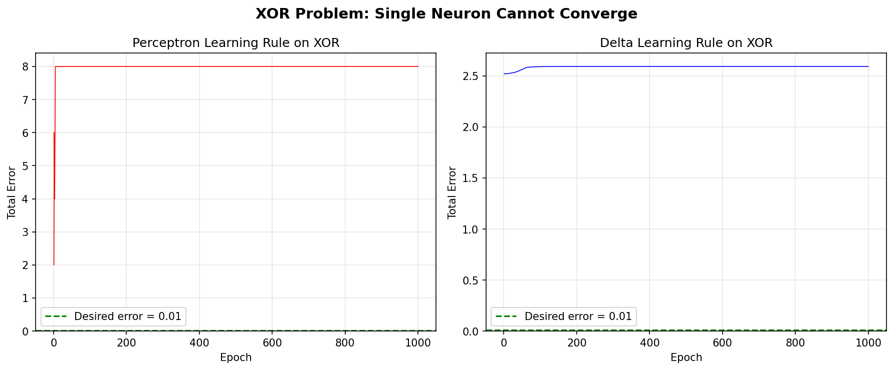
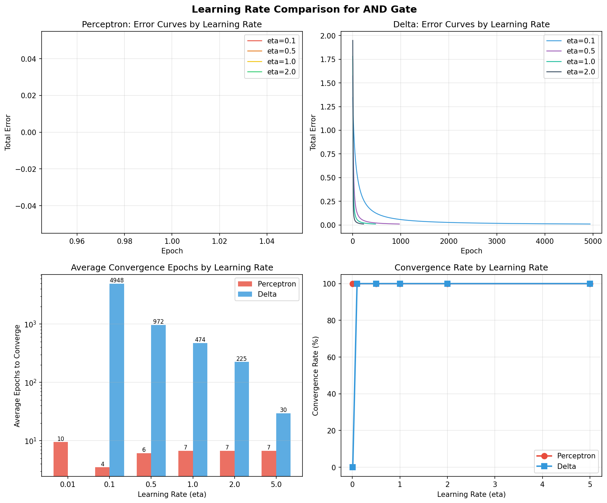

# CSA01 - チームプロジェクト1 パート1: 単一ニューロンの学習

**科目:** ニューラルネットワーク (CSA01)
**チームメンバー:** 佐藤 丞 (m5301059)

---

## a) 解いた問題

パート1の目的は、単一の人工ニューロンに対する2つの学習則、**パーセプトロン学習則**と**デルタ学習則**を実装し比較することである。

対象問題として**AND ゲート**を選択した。AND ゲートは線形分離可能な二値関数であり、単一ニューロンの学習に適している。訓練データは、2次元の二値入力（バイアス入力 -1 を加えた3入力）からなる4サンプルで構成される。

| 入力 x1 | 入力 x2 | バイアス | 期待出力 d |
|:-------:|:-------:|:-------:|:---------:|
| 0       | 0       | -1      | -1        |
| 0       | 1       | -1      | -1        |
| 1       | 0       | -1      | -1        |
| 1       | 1       | -1      | 1         |

出力は両方の入力が1の場合のみ+1（AND論理）、それ以外は-1となる。

### ソースコード: パーセプトロン学習則 (`perceptron_learning.c`)

```c
/*************************************************************/
/* C-program for perceptron-learning rule                    */
/* Learning rule of one neuron                               */
/*                                                           */
/* This program is produced by m5301059 SATO Sho.            */
/*************************************************************/
#include <stdio.h>
#include <stdlib.h>
#include <math.h>
#include <float.h>
#include <time.h>

#define I 3
#define n_sample 4
#define eta 0.5
#define lambda 1.0
#define desired_error 0.01
#define stepf(x) (x >= 0 ? 1 : -1)
#define frand() (rand() % 10000 / 10001.0)
#define randomize() srand((unsigned int)time(NULL))

// 2d { x, y, dummy input for bias(=-1)}
double x[n_sample][I] = {
    {0, 0, -1},
    {0, 1, -1},
    {1, 0, -1},
    {1, 1, -1},
};

double w[I];
double d[n_sample] = {-1, -1, -1, 1};
double o;

void Initialization(void);
void FindOutput(int);
void PrintResult(void);

int main()
{
  int i, p, q = 0;
  double delta, Error = DBL_MAX, LearningSignal;

  Initialization();
  while (Error > desired_error)
  {
    q++;
    Error = 0;
    for (p = 0; p < n_sample; p++)
    {
      FindOutput(p);
      Error += 0.5 * pow(d[p] - o, 2.0);
      LearningSignal = eta * (d[p] - o);
      for (i = 0; i < I; i++)
      {
        w[i] += LearningSignal * x[p][i];
      }
      printf("Error in the %d-th learning cycle=%f\n", q, Error);
    }
  }
  PrintResult();
}

/*************************************************************/
/* Initialization of the connection weights                  */
/*************************************************************/
void Initialization(void)
{
  int i;

  randomize();
  for (i = 0; i < I; i++)
    w[i] = frand();
}

/*************************************************************/
/* Find the actual outputs of the network                    */
/*************************************************************/
void FindOutput(int p)
{
  int i;
  double temp = 0;

  for (i = 0; i < I; i++)
    temp += w[i] * x[p][i];
  o = stepf(temp);
}

/*************************************************************/
/* Print out the final result                                */
/*************************************************************/
void PrintResult(void)
{
  int i, p;

  printf("\n\n");
  printf("The connection weights of the neurons:\n");
  for (i = 0; i < I; i++)
    printf("%5f ", w[i]);
  printf("\n\n");

  printf("Neuron output for each input pattern:\n");
  for (p = 0; p < n_sample; p++)
  {
    FindOutput(p);
    printf("(");
    for (i = 0; i < I; i++)
      printf(" %.1f,", x[p][i]);
    printf(") -> %5f\n", o);
  }
  printf("\n");
}
```

### ソースコード: デルタ学習則 (`delta_learning.c`)

```c
/*********************************************************************************/
/* C-program for delta-learning rule                                             */
/* Learning rule of one neuron                                                   */
/*                                                                               */
/* This program is produced by Qiangfu Zhao and extended by m5301059 SATO Sho.   */
/* You are free to use it for educational purpose                                */
/*********************************************************************************/
#include <stdio.h>
#include <stdlib.h>
#include <math.h>
#include <float.h>
#include <time.h>

#define I 3
#define n_sample 4
#define eta 0.5
#define lambda 1.0
#define desired_error 0.01
#define sigmoid(x) (2.0 / (1.0 + exp(-lambda * x)) - 1.0)
#define frand() (rand() % 10000 / 10001.0)
#define randomize() srand((unsigned int)time(NULL))

// 2d { x, y, dummy input for bias(=-1)}
double x[n_sample][I] = {
    {0, 0, -1},
    {0, 1, -1},
    {1, 0, -1},
    {1, 1, -1},
};

double w[I];
double d[n_sample] = {-1, -1, -1, 1};
double o;

void Initialization(void);
void FindOutput(int);
void PrintResult(void);

int main()
{
    int i, p, q = 0;
    double delta, Error = DBL_MAX;

    Initialization();
    while (Error > desired_error)
    {
        q++;
        Error = 0;
        for (p = 0; p < n_sample; p++)
        {
            FindOutput(p);
            Error += 0.5 * pow(d[p] - o, 2.0);
            for (i = 0; i < I; i++)
            {
                delta = (d[p] - o) * (1 - o * o) / 2;
                w[i] += eta * delta * x[p][i];
            }
            printf("Error in the %d-th learning cycle=%f\n", q, Error);
        }
    }
    PrintResult();
}

/*************************************************************/
/* Initialization of the connection weights                  */
/*************************************************************/
void Initialization(void)
{
    int i;

    randomize();
    for (i = 0; i < I; i++)
        w[i] = frand();
}

/*************************************************************/
/* Find the actual outputs of the network                    */
/*************************************************************/
void FindOutput(int p)
{
    int i;
    double temp = 0;

    for (i = 0; i < I; i++)
        temp += w[i] * x[p][i];
    o = sigmoid(temp);
}

/*************************************************************/
/* Print out the final result                                */
/*************************************************************/
void PrintResult(void)
{
    int i, p;

    printf("\n\n");
    printf("The connection weights of the neurons:\n");
    for (i = 0; i < I; i++)
        printf("%5f ", w[i]);
    printf("\n\n");

    printf("Neuron output for each input pattern:\n");
    for (p = 0; p < n_sample; p++)
    {
        FindOutput(p);
        printf("(");
        for (i = 0; i < I; i++)
            printf(" %.1f,", x[p][i]);
        printf(") -> %5f\n", o);
    }
    printf("\n");
}
```

## b) 使用した手法

### パーセプトロン学習則

パーセプトロン学習則は**ステップ関数（符号関数）**を活性化関数として使用する:

```
f(x) = +1  (x >= 0 の場合)
f(x) = -1  (x < 0 の場合)
```

重みの更新則は以下の通り:

```
w_i(t+1) = w_i(t) + eta * (d - o) * x_i
```

ここで `eta = 0.5` は学習率、`d` は期待出力、`o` は実際の出力、`x_i` は i 番目の入力である。各パターンの誤差は `E = 0.5 * (d - o)^2` で計算される。全サンプルの合計誤差が 0.01 未満になると学習を終了する。

### デルタ学習則

デルタ学習則は[-1, 1]の範囲にスケーリングされた**シグモイド活性化関数**を使用する:

```
f(x) = 2 / (1 + exp(-lambda * x)) - 1,  ここで lambda = 1.0
```

重みの更新則は以下の通り:

```
delta = (d - o) * (1 - o^2) / 2
w_i(t+1) = w_i(t) + eta * delta * x_i
```

`(1 - o^2) / 2` はシグモイド関数の導関数である。これにより勾配に基づく連続的な重み調整が可能となる。同じ収束条件（合計誤差 < 0.01）を使用する。

### 共通設定

- 入力数: 3（データ入力2 + バイアス1）
- 学習率 (eta): 0.5
- 重みは [0, 1) の範囲でランダムに初期化
- 収束閾値: 0.01

## c) シミュレーション結果に関する考察

### パーセプトロン学習の結果

パーセプトロン学習則は **5 エポック** で収束した。最終的な結合重みは以下の通り:

```
w = [1.528, 1.227, 2.427]
```

全入力パターンに対する最終出力:

| 入力         | 出力  | 期待値 |
|:-----------:|:-----:|:-----:|
| (0, 0, -1)  | -1    | -1    |
| (0, 1, -1)  | -1    | -1    |
| (1, 0, -1)  | -1    | -1    |
| (1, 1, -1)  | +1    | +1    |

全ての出力が期待値と完全に一致した。パーセプトロンはAND関数を完全に分類できた。

### デルタ学習の結果

デルタ学習則は **969 エポック** で収束した。最終的な結合重みは以下の通り:

```
w = [6.281, 6.278, 9.503]
```

全入力パターンに対する最終出力:

| 入力         | 出力      | 期待値 |
|:-----------:|:--------:|:-----:|
| (0, 0, -1)  | -0.9999  | -1    |
| (0, 1, -1)  | -0.9235  | -1    |
| (1, 0, -1)  | -0.9233  | -1    |
| (1, 1, -1)  | +0.9101  | +1    |

シグモイド関数は連続関数であり、目標値に漸近的に近づくため、全ての出力は期待値に近いが正確には一致しない。

### 比較と考察

1. **収束速度:** パーセプトロン学習則はデルタ学習則（969エポック）と比べて著しく速く収束した（5エポック）。これは、ステップ関数が正確な +1/-1 の出力を生成するため、決定境界が正しく配置されると直ちに誤差がゼロになるためである。一方、シグモイド関数は +/-1 に近づくが到達しない連続的な出力を生成するため、誤差を閾値以下に減少させるのにより多くの反復が必要となる。

2. **出力精度:** パーセプトロンの出力は正確に +1 または -1 であるのに対し、デルタ学習の出力は近似値（例: +1 の代わりに +0.91）となる。これはシグモイド活性化関数の固有の特性である。

3. **重みの大きさ:** デルタ学習則はパーセプトロン（約1〜2）と比べて大きな重み（約6〜9）を生成する。シグモイド関数の出力を飽和値 +/-1 に近づけるためには、より大きな重みが必要となる。

4. **決定境界:** 両手法ともAND関数を正しく分離する有効な決定境界を学習する。パーセプトロンは最小限の重み調整で境界を見つけるが、デルタ則ではシグモイド出力を飽和に近づけるために重みが大きくなる必要がある。

5. **微分可能性:** デルタ学習則の主な利点は、微分可能な活性化関数を使用することで勾配ベースの学習が可能になることである。AND のような単純な線形分離可能問題では必要ないが、逆伝播が必要な複雑な問題や多層ネットワークでは不可欠となる。

6. **誤差の推移:** パーセプトロンの誤差は離散的なジャンプで減少する（d と o の差が 2 のとき `(d-o)^2 = 4` となるため 2 の倍数）のに対し、デルタ学習の誤差は滑らかに漸減し、シグモイド活性化の連続的な性質を反映している。

---

## d) 新しい問題: XOR ゲート

### 問題の説明

単一ニューロンの根本的な限界を示すために、両学習則を **XOR（排他的論理和）** 問題に適用した。XOR は非線形分離問題である:

| 入力 x1 | 入力 x2 | 期待出力 d |
|:-------:|:-------:|:---------:|
| 0       | 0       | -1        |
| 0       | 1       | +1        |
| 1       | 0       | +1        |
| 1       | 1       | -1        |

入力空間において +1 の出力と -1 の出力を一本の直線で分離することはできない。これは、使用する学習則に関係なく、単一ニューロンではこの問題を解けないことを意味する。

### 結果

両学習則を最大 1,000 エポック実行した:

- **パーセプトロン:** 収束しなかった。最終誤差 = 8.0（初期エポック以降一定値を維持）
- **デルタ学習:** 収束しなかった。最終誤差 = 2.59（この付近で安定）

パーセプトロンの誤差が 8.0 で安定したのは、4パターン中2パターンが常に誤分類されるため（各誤差 4.0）である。デルタ学習の誤差が約 2.59 で安定したのは、シグモイド出力が 0 付近（+1 でも -1 でもない）に落ち着き、有効な分離を見つけられなかったためである。

### 理論的説明

単一ニューロンは線形決定境界 `w1*x1 + w2*x2 - w_bias = 0` を計算する。これは2次元空間における直線である。XOR 関数は +1 クラス（角 (0,1) と (1,0)）が -1 クラス（角 (0,0) と (1,1)）から一本の直線では分離できない2つの領域に存在する。これは Minsky と Papert (1969) による古典的な結果であり、パーセプトロンが非線形分離問題を解けないことを証明したものである。



*図1: XOR における両学習則の誤差曲線。いずれも目標誤差閾値に収束しない。*

---

## e) 手法の改良: 学習率の比較

### 説明

AND ゲート問題に対する学習率（eta）の収束速度と安定性への影響を調査した。6つの学習率を検証: **0.01, 0.1, 0.5, 1.0, 2.0, 5.0**。各学習率について、異なるランダムシードで10回の試行を実施した。

### 結果

| eta  | パーセプトロン平均エポック | パーセプトロン収束率 | デルタ平均エポック | デルタ収束率 |
|:----:|:---------------------:|:------------------:|:----------------:|:-----------:|
| 0.01 | 9.5                   | 100%               | N/A              | 0%          |
| 0.10 | 3.5                   | 100%               | 4947.5           | 100%        |
| 0.50 | 6.1                   | 100%               | 971.6            | 100%        |
| 1.00 | 6.7                   | 100%               | 474.5            | 100%        |
| 2.00 | 6.7                   | 100%               | 225.1            | 100%        |
| 5.00 | 6.7                   | 100%               | 29.6             | 100%        |

### 分析

1. **パーセプトロン:** パーセプトロンは学習率に対して比較的鈍感である。全ての eta 値で 100% 収束を達成した。非常に小さい eta（0.01）では重み更新が小さいためやや多くのエポックを要するが、線形分離可能問題に対しては常に速く収束する。

2. **デルタ学習:** デルタ則は学習率に高い感度を示す:
   - **eta = 0.01:** 10,000 エポック以内に収束しなかった。更新が小さすぎてシグモイド出力を +/-1 に十分近づけられない。
   - **eta = 0.1:** 収束したが平均約 5,000 エポックを要した。
   - **eta = 5.0:** わずか約 30 エポックで収束し、eta = 0.1 と比較して 170 倍の改善。
   - デルタ則における eta と収束速度の関係は概ね逆比例である。

3. **重要な知見:** デルタ則では、大きな学習率が収束を劇的に加速する。これはシグモイドの導関数 `(1-o^2)/2` が飽和付近で小さくなり、「勾配消失」効果を生じるためである。大きな eta がこの小さな勾配を補償する。ただし、より複雑な問題では過度に大きな eta は発散を引き起こす可能性がある。



*図2: AND ゲートの学習率比較。上段: 誤差曲線。左下: 平均収束エポック数（対数スケール）。右下: 収束率。*

---

## f) 拡張実験に関する考察

### 知見のまとめ

d) と e) の拡張実験から、単一ニューロン学習に関する2つの重要な側面が明らかになった:

1. **根本的限界（XOR）:** XOR 実験は、学習則や活性化関数に関係なく、単一ニューロンが非線形分離問題を解けないことを決定的に示した。パーセプトロンの誤差は減少せずに振動し、デルタ則の誤差は局所最小値で停滞する。この限界が多層ニューラルネットワークと逆伝播アルゴリズムの開発を動機づけた。

2. **ハイパーパラメータ感度:** 学習率比較は、パーセプトロンが eta の選択に対して頑健である（離散出力のため）一方、デルタ則は慎重なチューニングを要することを示した。小さすぎる eta は極めて遅い収束や失敗につながり、大きな値は学習を劇的に加速する。これは勾配ベース手法におけるハイパーパラメータチューニングの重要性を浮き彫りにし、深層ニューラルネットワークの訓練における課題を予見するものである。
