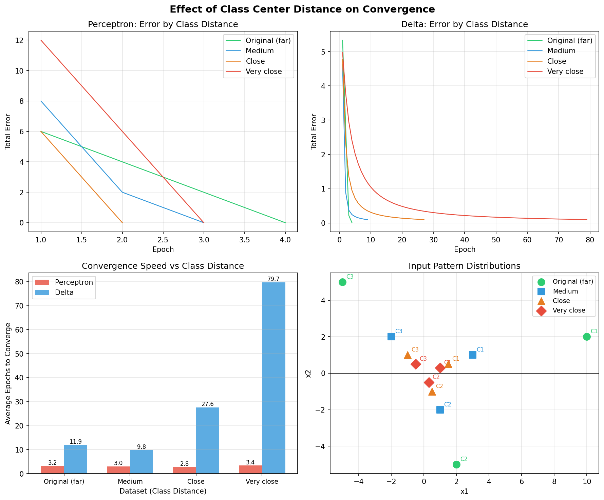
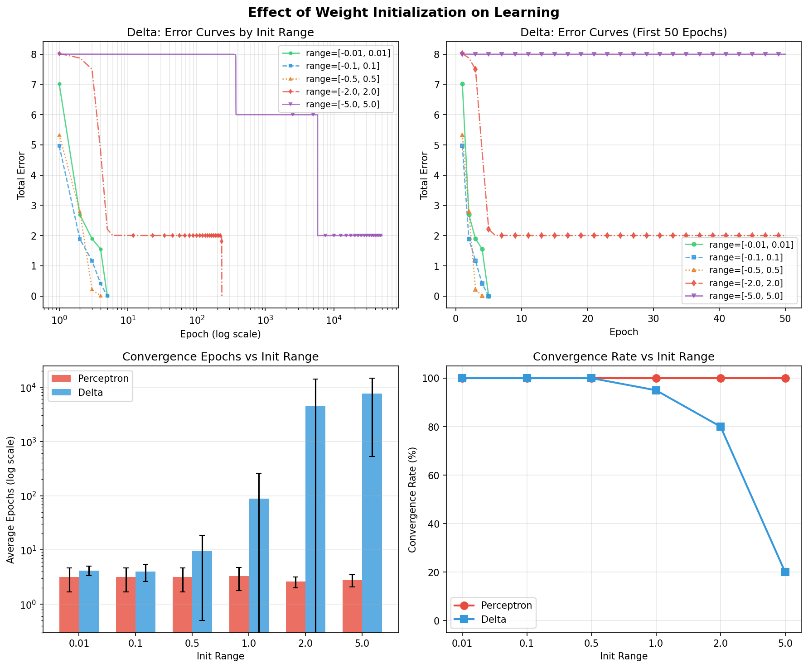

# CSA01 - チームプロジェクト1 パート2: 単層ニューラルネットワーク

**科目:** ニューラルネットワーク (CSA01)  
**チームメンバー:**
- 佐藤 丞 (m5301059)
- 宇佐美 雄貴 (m5301073)
- 関根 健人 (m5301060)
- 相澤 祐真 (m5301001)
- 渡部 千歳 (m5301074)

---

## a) 解いた問題

パート2では、パート1の単一ニューロンのプログラムを**単層ニューラルネットワーク**（出力ニューロンが複数）に拡張した。3つの入力パターンを3つのクラスに分類するのが課題になる。

ネットワークは入力 N=3（データ2つ + バイアス -1）、出力 R=3（各クラスに1つ）の構成。訓練データは以下の通り:

| サンプル | 入力 x1 | 入力 x2 | バイアス | 期待出力 (o1, o2, o3) |
|:------:|:------:|:------:|:------:|:--------------------:|
| 1      | 10     | 2      | -1     | (+1, -1, -1)         |
| 2      | 2      | -5     | -1     | (-1, +1, -1)         |
| 3      | -5     | 5      | -1     | (-1, -1, +1)         |

正しいクラスの出力が+1、それ以外が-1になるようにする。

### ソースコード: パーセプトロン学習則 (`perceptron_learning_NN.c`)

```c
/*************************************************************/
/* C-program for learning of single layer neural network     */
/* based on the delta learning rule                          */
/*                                                           */
/*  1) Number of Inputs : N                                  */
/*  2) Number of Output : R                                  */
/* The last input for all neurons is always -1               */
/*                                                           */
/* This program is produced by m5301059 SATO Sho.            */
/*************************************************************/
#include <stdio.h>
#include <stdlib.h>
#include <math.h>
#include <float.h>
#include <time.h>

#define N 3
#define R 3
#define n_sample 3
#define eta 0.5
#define lambda 1.0
#define desired_error 0.1
#define stepf(x) (x >= 0 ? 1 : -1)
#define frand() (rand() % 10000 / 10001.0)
#define randomize() srand((unsigned int)time(NULL))

double x[n_sample][N] = {
    {10, 2, -1},
    {2, -5, -1},
    {-5, 5, -1},
};
double d[n_sample][R] = {
    {1, -1, -1},
    {-1, 1, -1},
    {-1, -1, 1},
};
double w[R][N];
double o[R];

void Initialization(void);
void FindOutput(int);
void PrintResult(void);

int main()
{
  int i, j, p, q = 0;
  double Error = DBL_MAX;
  double delta, LearningSignal;

  Initialization();
  while (Error > desired_error)
  {
    q++;
    Error = 0;
    for (p = 0; p < n_sample; p++)
    {
      FindOutput(p);
      for (i = 0; i < R; i++)
      {
        Error += 0.5 * pow(d[p][i] - o[i], 2.0);
      }
      for (i = 0; i < R; i++)
      {
        LearningSignal = eta * (d[p][i] - o[i]);
        for (j = 0; j < N; j++)
        {
          w[i][j] += LearningSignal * x[p][j];
        }
      }
    }
    printf("Error in the %d-th learning cycle=%f\n", q, Error);
  }
  PrintResult();
}

/*************************************************************/
/* Initialization of the connection weights                  */
/*************************************************************/
void Initialization(void)
{
  int i, j;

  randomize();
  for (i = 0; i < R; i++)
    for (j = 0; j < N; j++)
      w[i][j] = frand() - 0.5;
}

/*************************************************************/
/* Find the actual outputs of the network                    */
/*************************************************************/
void FindOutput(int p)
{
  int i, j;
  double temp;

  for (i = 0; i < R; i++)
  {
    temp = 0;
    for (j = 0; j < N; j++)
    {
      temp += w[i][j] * x[p][j];
    }
    o[i] = stepf(temp);
  }
}

/*************************************************************/
/* Print out the final result                                */
/*************************************************************/
void PrintResult(void)
{
  int i, j, p;

  printf("\n\n");
  printf("The connection weights are:\n");
  for (i = 0; i < R; i++)
  {
    for (j = 0; j < N; j++)
      printf("%5f ", w[i][j]);
    printf("\n");
  }
  printf("\n\n");

  printf("Neuron output for each input pattern:\n");
  for (p = 0; p < n_sample; p++)
  {
    FindOutput(p);
    printf("(");
    for (i = 0; i < N; i++)
      printf(" %.1f,", x[p][i]);
    printf(") -> (");
    for (i = 0; i < R; i++)
      printf(" %5f,", o[i]);
    printf(")\n");
  }
  printf("\n");
}
```

### ソースコード: デルタ学習則 (`delta_learning_NN.c`)

```c
/***********************************************************************************/
/* C-program for learning of single layer neural network                           */
/* based on the delta learning rule                                                */
/*                                                                                 */
/*  1) Number of Inputs : N                                                        */
/*  2) Number of Output : R                                                        */
/* The last input for all neurons is always -1                                     */
/*                                                                                 */
/* This program is produced by Qiangfu Zhao and extended by m5301059 SATO Sho.     */
/* You are free to use it for educational purpose                                  */
/***********************************************************************************/
#include <stdio.h>
#include <stdlib.h>
#include <math.h>
#include <float.h>
#include <time.h>

#define N 3
#define R 3
#define n_sample 3
#define eta 0.5
#define lambda 1.0
#define desired_error 0.1
#define sigmoid(x) (2.0 / (1.0 + exp(-lambda * x)) - 1.0)
#define frand() (rand() % 10000 / 10001.0)
#define randomize() srand((unsigned int)time(NULL))

double x[n_sample][N] = {
    {10, 2, -1},
    {2, -5, -1},
    {-5, 5, -1},
};
double d[n_sample][R] = {
    {1, -1, -1},
    {-1, 1, -1},
    {-1, -1, 1},
};
double w[R][N];
double o[R];

void Initialization(void);
void FindOutput(int);
void PrintResult(void);

int main()
{
  int i, j, p, q = 0;
  double Error = DBL_MAX;
  double delta;

  Initialization();
  while (Error > desired_error)
  {
    q++;
    Error = 0;
    for (p = 0; p < n_sample; p++)
    {
      FindOutput(p);
      for (i = 0; i < R; i++)
      {
        Error += 0.5 * pow(d[p][i] - o[i], 2.0);
      }
      for (i = 0; i < R; i++)
      {
        delta = (d[p][i] - o[i]) * (1 - o[i] * o[i]) / 2;
        for (j = 0; j < N; j++)
        {
          w[i][j] += eta * delta * x[p][j];
        }
      }
    }
    printf("Error in the %d-th learning cycle=%f\n", q, Error);
  }
  PrintResult();
}

/*************************************************************/
/* Initialization of the connection weights                  */
/*************************************************************/
void Initialization(void)
{
  int i, j;

  randomize();
  for (i = 0; i < R; i++)
    for (j = 0; j < N; j++)
      w[i][j] = frand() - 0.5;
}

/*************************************************************/
/* Find the actual outputs of the network                    */
/*************************************************************/
void FindOutput(int p)
{
  int i, j;
  double temp;

  for (i = 0; i < R; i++)
  {
    temp = 0;
    for (j = 0; j < N; j++)
    {
      temp += w[i][j] * x[p][j];
    }
    o[i] = sigmoid(temp);
  }
}

/*************************************************************/
/* Print out the final result                                */
/*************************************************************/
void PrintResult(void)
{
  int i, j, p;

  printf("\n\n");
  printf("The connection weights are:\n");
  for (i = 0; i < R; i++)
  {
    for (j = 0; j < N; j++)
      printf("%5f ", w[i][j]);
    printf("\n");
  }
  printf("\n\n");

  printf("Neuron output for each input pattern:\n");
  for (p = 0; p < n_sample; p++)
  {
    FindOutput(p);
    printf("(");
    for (i = 0; i < N; i++)
      printf(" %.1f,", x[p][i]);
    printf(") -> (");
    for (i = 0; i < R; i++)
      printf(" %5f,", o[i]);
    printf(")\n");
  }
  printf("\n");
}
```

## b) 使用した手法

### パーセプトロン学習則（単層ネットワーク）

3つの出力ニューロンがそれぞれ長さ3の重みベクトルを持つ。活性化関数はパート1と同じステップ関数。出力ニューロン i の重み更新は:

```
w_ij(t+1) = w_ij(t) + eta * (d_i - o_i) * x_j
```

合計誤差は、全出力ニューロン・全サンプルの二乗誤差を足し合わせたもの。

### デルタ学習則（単層ネットワーク）

パート1と同じシグモイド関数を各出力ニューロンに独立に適用する:

```
delta_i = (d_i - o_i) * (1 - o_i^2) / 2
w_ij(t+1) = w_ij(t) + eta * delta_i * x_j
```

### 共通の設定

- 学習率 (eta): 0.5
- 収束閾値: 0.1（パート1の 0.01 より緩い）
- 重みは [-0.5, 0.5) でランダム初期化

## c) シミュレーション結果に関する考察

### パーセプトロンの結果

**4エポック**で収束した。最終的な重み行列:

```
ニューロン1: [4.121,  4.974,  4.615]
ニューロン2: [-2.803, -12.022, 1.111]
ニューロン3: [-9.803, -1.609,  0.993]
```

| 入力             | 出力              | 期待値             |
|:---------------:|:-----------------:|:-----------------:|
| (10, 2, -1)     | (+1, -1, -1)      | (+1, -1, -1)      |
| (2, -5, -1)     | (-1, +1, -1)      | (-1, +1, -1)      |
| (-5, 5, -1)     | (-1, -1, +1)      | (-1, -1, +1)      |

全パターン正解。

### デルタ学習の結果

**3エポック**で収束した。最終的な重み行列:

```
ニューロン1: [2.224,  1.556, -0.004]
ニューロン2: [-1.323, -2.837, 0.455]
ニューロン3: [-0.485,  0.392, 0.249]
```

| 入力             | 出力                         | 期待値             |
|:---------------:|:---------------------------:|:-----------------:|
| (10, 2, -1)     | (+1.000, -1.000, -0.974)    | (+1, -1, -1)      |
| (2, -5, -1)     | (-0.931, +1.000, -0.920)    | (-1, +1, -1)      |
| (-5, 5, -1)     | (-0.931, -0.999, +0.968)    | (-1, -1, +1)      |

目標に近い値が出ており、正しいクラスのニューロンが常に最大の出力値を持っている。

### 比較

面白いことに、パート2ではデルタ則（3エポック）の方がパーセプトロン（4エポック）より早く収束した。パート1ではパーセプトロンの方がずっと速かった（5 vs. 969）ので、逆の結果になった。おそらく、パート2では収束閾値が0.1と緩めなのと、入力値が大きい（10, -5 など）ことが影響している。入力が大きいと、ちょっとした重みの変化でも重み付き和が大きく変わるので、シグモイドの出力がすぐに目標付近に到達できたのだと思う。

重みの大きさはパーセプトロンの方がずっと大きかった（最大12）。パーセプトロンの誤差信号は0か+/-2の離散値なので、1回の更新で重みが大きく動く。デルタ則は勾配に基づく小さめの更新なので、重みは最大3程度にとどまった。

分類結果はどちらも正しいが、パーセプトロンはぴったり+1/-1を出すのに対し、デルタ則は-0.974のような近似値になる。分類という目的では、出力が最大のクラスを選べばよいのでどちらでも問題ない。

---

## d) 新しい問題: より近いクラス中心

クラス中心の距離が学習にどう影響するか調べたくなったので、元のデータ（中心間距離が大きい）に加えて、中心を近づけた3パターンのデータセットを作って比較した:

| データセット | クラス1    | クラス2     | クラス3     |
|:----------:|:----------:|:-----------:|:-----------:|
| 元問題      | (10, 2)    | (2, -5)     | (-5, 5)     |
| 中程度      | (3, 1)     | (1, -2)     | (-2, 2)     |
| 近い        | (1.5, 0.5) | (0.5, -1.0) | (-1.0, 1.0) |
| 非常に近い  | (1.0, 0.3) | (0.3, -0.5) | (-0.5, 0.5) |

各データセットでランダムシードを変えて10回ずつ試した（eta = 0.5, 閾値 = 0.1）。

| データセット | パーセプトロン平均エポック | デルタ平均エポック |
|:----------:|:---------------------:|:----------------:|
| 元問題      | 3.2                   | 11.9             |
| 中程度      | 3.0                   | 9.8              |
| 近い        | 2.8                   | 27.6             |
| 非常に近い  | 3.4                   | 79.7             |

全試行が収束した。

パーセプトロンはどのデータセットでも3エポック前後で変わらなかった。ステップ関数は重み付き和の符号だけで判定するので、入力の大きさはあまり関係ない。

デルタ則の方はクラスが近くなるほど遅くなった。「元問題」の12エポックから「非常に近い」では80エポックと、約7倍の差が出た。入力パターンが似ていると、シグモイドの出力もパターン間で似た値になりやすく、誤差信号が小さくなって重み更新が進みにくくなるためだと考えられる。



*図3: クラス中心距離による収束の違い。右下は4つのデータセットの入力分布。*

---

## e) 手法の改良: 重み初期化の影響

重みの初期値の範囲を変えたらどうなるかも試した。元問題のデータを使い、初期化範囲を [-0.01, 0.01], [-0.1, 0.1], [-0.5, 0.5], [-1.0, 1.0], [-2.0, 2.0], [-5.0, 5.0] の6通りで、それぞれ20回ずつ実行した。

| 初期化範囲 | デルタ平均エポック | デルタ標準偏差 | デルタ収束率 | パーセプトロン平均 | パーセプトロン収束率 |
|:---------:|:----------------:|:------------:|:-----------:|:--------------:|:----------------:|
| 0.01      | 4.2              | 0.8          | 100%        | 3.2            | 100%             |
| 0.10      | 4.0              | 1.4          | 100%        | 3.2            | 100%             |
| 0.50      | 9.5              | 9.0          | 100%        | 3.2            | 100%             |
| 1.00      | 87.5             | 172.4        | 95%         | 3.3            | 100%             |
| 2.00      | 4521.1           | 9465.3       | 80%         | 2.6            | 100%             |
| 5.00      | 7579.2           | 7051.6       | 20%         | 2.8            | 100%             |

パーセプトロンは初期値に全く左右されず、どの範囲でも3エポック程度で収束した。

デルタ則はかなり影響を受けた。初期値が小さい（範囲0.01〜0.10）ときは約4エポックで安定して収束するが、範囲を5.0にすると20回中4回しか50,000エポック以内に収束しなかった。

原因は、初期重みが大きいとシグモイドの出力が最初から+1か-1付近に張り付いてしまい（飽和状態）、導関数 `(1-o^2)/2` がほぼゼロになること。勾配がゼロに近いと重みがほとんど更新されないので、学習が進まなくなる。いわゆる勾配消失の問題で、標準偏差も範囲0.01の0.8から範囲2.0の9,465まで跳ね上がっていて、結果がかなりばらつくようになる。



*図4: 重み初期化範囲の影響。右下のグラフで、範囲が大きくなると収束率が急落しているのがわかる。*

---

## f) 拡張実験に関する考察

クラス距離の実験 (d) では、パーセプトロンはクラスが近くても速度が変わらないのに対し、デルタ則はクラスが近いほど遅くなることがわかった。ステップ関数は入力値の大小を気にしないが、シグモイドは入力値が近いと出力も近くなってしまうため、この違いが出ると考えられる。

重み初期化の実験 (e) では、大きい初期重みがデルタ則にとって致命的だとわかった。シグモイドが飽和して勾配がなくなるので、ゼロに近い小さな初期値で始めるのが良い。パーセプトロンにはこの問題がない。

まとめると、デルタ則はシグモイド関数が微分可能なので多層ネットワークへの拡張には向いているが、学習率や初期重みの設定に気をつけないとうまく学習が進まないことがある。パーセプトロンはこれらの設定に強いが、ステップ関数が微分できないので多層ネットワークには使えない、というトレードオフがある。
