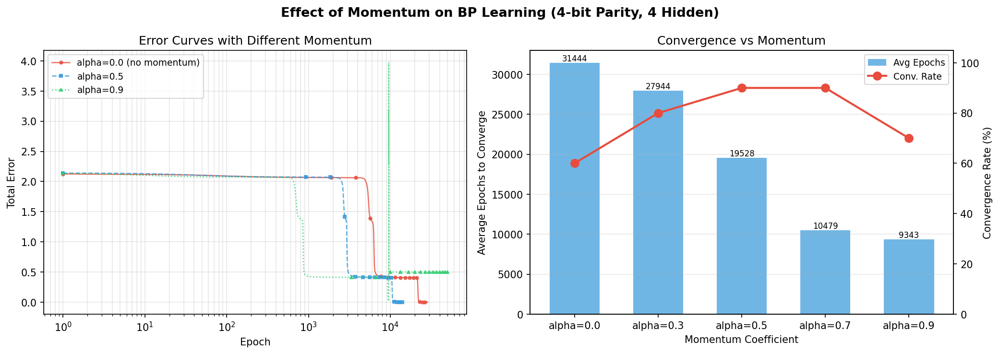

# CSA01 - Team Project 2, Part 1: Multilayer Perceptron with Backpropagation

**Course:** Neural Networks (CSA01)  
**Team Members:**
- SATO Sho (m5301059)
- USAMI Yuki (m5301073)
- SEKINE Kento (m5301060)
- AIZAWA Yuma (m5301001)
- WATABE Chitose (m5301074)

---

## a) Problem Description

In this project, we implemented the backpropagation (BP) algorithm for a three-layer neural network and tested it on the **4-bit parity check problem**.

The parity function outputs 1 if the number of 1s among the 4 input bits is even, and 0 if it is odd. This is a classic benchmark for multilayer networks because it is not linearly separable -- you cannot solve it with a single-layer network.

The network has the following structure:
- **Input layer:** 5 units (4 bits + 1 dummy input fixed at -1 for bias)
- **Hidden layer:** variable number of neurons (we tested 4, 6, 8, and 10)
- **Output layer:** 1 neuron, with output in [0, 1]

There are 16 training samples (all possible 4-bit patterns):

| Pattern | x1 | x2 | x3 | x4 | Bias | # of 1s | Desired Output |
|:-------:|:--:|:--:|:--:|:--:|:----:|:--------:|:--------------:|
| 0       | 0  | 0  | 0  | 0  | -1   | 0 (even) | 1              |
| 1       | 0  | 0  | 0  | 1  | -1   | 1 (odd)  | 0              |
| 2       | 0  | 0  | 1  | 0  | -1   | 1 (odd)  | 0              |
| 3       | 0  | 0  | 1  | 1  | -1   | 2 (even) | 1              |
| 4       | 0  | 1  | 0  | 0  | -1   | 1 (odd)  | 0              |
| 5       | 0  | 1  | 0  | 1  | -1   | 2 (even) | 1              |
| 6       | 0  | 1  | 1  | 0  | -1   | 2 (even) | 1              |
| 7       | 0  | 1  | 1  | 1  | -1   | 3 (odd)  | 0              |
| 8       | 1  | 0  | 0  | 0  | -1   | 1 (odd)  | 0              |
| 9       | 1  | 0  | 0  | 1  | -1   | 2 (even) | 1              |
| 10      | 1  | 0  | 1  | 0  | -1   | 2 (even) | 1              |
| 11      | 1  | 0  | 1  | 1  | -1   | 3 (odd)  | 0              |
| 12      | 1  | 1  | 0  | 0  | -1   | 2 (even) | 1              |
| 13      | 1  | 1  | 0  | 1  | -1   | 3 (odd)  | 0              |
| 14      | 1  | 1  | 1  | 0  | -1   | 3 (odd)  | 0              |
| 15      | 1  | 1  | 1  | 1  | -1   | 4 (even) | 1              |

### Source Code: Backpropagation (`multilayer_perceptron.c`)

```c
/************************************************************************************/
/* C-program for BP algorithm                                                       */
/* The nerual network to be designed is supposed to have                            */
/* three layers:                                                                    */
/*  1) Input layer : I inputs                                                       */
/*  2) Hidden layer: J neurons                                                      */
/*  3) Output layer: K neurons                                                      */
/* The last input is always -1, and the output of the last                          */
/* hidden neuron is also -1.                                                        */
/*                                                                                  */
/* This program is produced by Qiangfu Zhao and extended by m5301059 SATO Sho.      */
/* You are free to use it for educational purpose                                   */
/************************************************************************************/
#include <stdio.h>
#include <stdlib.h>
#include <math.h>
#include <float.h>
#include <time.h>

#define I 5
#define J 5
#define K 1
#define n_sample 16
#define eta 0.5
#define lambda 1.0
#define desired_error 0.001
#define sigmoid(x) (1.0 / (1.0 + exp(-lambda * x)))
#define frand() (rand() % 10000 / 10001.0)
#define randomize() srand((unsigned int)time(NULL))

double x[n_sample][I] = {
    {0, 0, 0, 0, -1},
    {0, 0, 0, 1, -1},
    {0, 0, 1, 0, -1},
    {0, 0, 1, 1, -1},
    {0, 1, 0, 0, -1},
    {0, 1, 0, 1, -1},
    {0, 1, 1, 0, -1},
    {0, 1, 1, 1, -1},
    {1, 0, 0, 0, -1},
    {1, 0, 0, 1, -1},
    {1, 0, 1, 0, -1},
    {1, 0, 1, 1, -1},
    {1, 1, 0, 0, -1},
    {1, 1, 0, 1, -1},
    {1, 1, 1, 0, -1},
    {1, 1, 1, 1, -1}};
double d[n_sample][K] = {1, 0, 0, 1, 0, 1, 1, 0, 0, 1, 1, 0, 1, 0, 0, 1};
double v[J][I], w[K][J];
double y[J];
double o[K];

void Initialization(void);
void FindHidden(int p);
void FindOutput(void);
void PrintResult(void);

int main()
{
    int i, j, k, p, q = 0;
    double Error = DBL_MAX;
    double delta_o[K];
    double delta_y[J];

    Initialization();
    while (Error > desired_error)
    {
        q++;
        Error = 0;
        for (p = 0; p < n_sample; p++)
        {
            FindHidden(p);
            FindOutput();

            for (k = 0; k < K; k++)
            {
                Error += 0.5 * pow(d[p][k] - o[k], 2.0);
                delta_o[k] = (d[p][k] - o[k]) * (1 - o[k]) * o[k];
            }

            for (j = 0; j < J; j++)
            {
                delta_y[j] = 0;
                for (k = 0; k < K; k++)
                    delta_y[j] += delta_o[k] * w[k][j];
                delta_y[j] = (1 - y[j]) * y[j] * delta_y[j];
            }

            for (k = 0; k < K; k++)
                for (j = 0; j < J; j++)
                    w[k][j] += eta * delta_o[k] * y[j];

            for (j = 0; j < J; j++)
                for (i = 0; i < I; i++)
                    v[j][i] += eta * delta_y[j] * x[p][i];
        }
        printf("Error in the %d-th learning cycle = %f\n", q, Error);
    }

    PrintResult();
}

/*************************************************************/
/* Initialization of the connection weights                  */
/*************************************************************/
void Initialization(void)
{
    int i, j, k;

    randomize();
    for (j = 0; j < J; j++)
        for (i = 0; i < I; i++)
            v[j][i] = frand() - 0.5;

    for (k = 0; k < K; k++)
        for (j = 0; j < J; j++)
            w[k][j] = frand() - 0.5;
}

/*************************************************************/
/* Find the output of the hidden neurons                     */
/*************************************************************/
void FindHidden(int p)
{
    int i, j;
    double temp;

    for (j = 0; j < J - 1; j++)
    {
        temp = 0;
        for (i = 0; i < I; i++)
            temp += v[j][i] * x[p][i];
        y[j] = sigmoid(temp);
    }
    y[J - 1] = -1;
}

/*************************************************************/
/* Find the actual outputs of the network                    */
/*************************************************************/
void FindOutput(void)
{
    int j, k;
    double temp;

    for (k = 0; k < K; k++)
    {
        temp = 0;
        for (j = 0; j < J; j++)
            temp += w[k][j] * y[j];
        o[k] = sigmoid(temp);
    }
}

/*************************************************************/
/* Print out the final result                                */
/*************************************************************/
void PrintResult(void)
{
    int i, j, k, p;

    printf("\n\n");
    printf("The connection weights in the output layer:\n");
    for (k = 0; k < K; k++)
    {
        for (j = 0; j < J; j++)
            printf("%5f ", w[k][j]);
        printf("\n");
    }

    printf("\n\n");
    printf("The connection weights in the hidden layer:\n");
    for (j = 0; j < J - 1; j++)
    {
        for (i = 0; i < I; i++)
            printf("%5f ", v[j][i]);
        printf("\n");
    }
    printf("\n\n");

    printf("Neuron output for each input pattern:\n");
  for (p = 0; p < n_sample; p++)
  {
    FindHidden(p);
    FindOutput();
    printf("(");
    for (i = 0; i < I; i++)
      printf(" %.1f,", x[p][i]);
    printf(") -> (");
    for (i = 0; i < K; i++)
      printf(" %5f,", o[i]);
    printf(")\n");
  }
  printf("\n");
}
```

### Source Code: Experiment Script (`multilayer_perceptron_exp.c`)

For the hidden neuron comparison experiment, we created a version that accepts the hidden layer size at compile time (`-DJ_VAL=`) and the random seed as a command-line argument. This lets us run multiple trials with different initializations.

```c
/************************************************************************************/
/* C-program for BP algorithm (experiment version)                                 */
/* Compile with: gcc multilayer_perceptron_exp.c -o bp_exp.out -lm -DJ_VAL=5       */
/* Usage: ./bp_exp.out [seed]                                                      */
/*                                                                                 */
/* J_VAL includes 1 bias neuron, so hidden neurons = J_VAL - 1.                    */
/* This program is produced by Qiangfu Zhao and extended by m5301059 SATO Sho.     */
/************************************************************************************/
#include <stdio.h>
#include <stdlib.h>
#include <math.h>
#include <float.h>

#define I 5
#ifndef J_VAL
#define J_VAL 5
#endif
#define J J_VAL
#define K 1
#define n_sample 16
#define eta 0.5
#define lambda 1.0
#define desired_error 0.001
#ifndef MAX_EPOCH
#define MAX_EPOCH 50000
#endif
#define sigmoid(x) (1.0 / (1.0 + exp(-lambda * (x))))
#define frand() (rand() % 10000 / 10001.0)

double x[n_sample][I] = {
    {0, 0, 0, 0, -1},
    {0, 0, 0, 1, -1},
    {0, 0, 1, 0, -1},
    {0, 0, 1, 1, -1},
    {0, 1, 0, 0, -1},
    {0, 1, 0, 1, -1},
    {0, 1, 1, 0, -1},
    {0, 1, 1, 1, -1},
    {1, 0, 0, 0, -1},
    {1, 0, 0, 1, -1},
    {1, 0, 1, 0, -1},
    {1, 0, 1, 1, -1},
    {1, 1, 0, 0, -1},
    {1, 1, 0, 1, -1},
    {1, 1, 1, 0, -1},
    {1, 1, 1, 1, -1}};
double d[n_sample] = {1, 0, 0, 1, 0, 1, 1, 0, 0, 1, 1, 0, 1, 0, 0, 1};
double v[J][I], w[K][J];
double y[J];
double o[K];

void Initialization(unsigned int seed)
{
    int i, j, k;
    srand(seed);
    for (j = 0; j < J; j++)
        for (i = 0; i < I; i++)
            v[j][i] = frand() - 0.5;
    for (k = 0; k < K; k++)
        for (j = 0; j < J; j++)
            w[k][j] = frand() - 0.5;
}

void FindHidden(int p)
{
    int i, j;
    double temp;
    for (j = 0; j < J - 1; j++)
    {
        temp = 0;
        for (i = 0; i < I; i++)
            temp += v[j][i] * x[p][i];
        y[j] = sigmoid(temp);
    }
    y[J - 1] = -1;
}

void FindOutput(void)
{
    int j, k;
    double temp;
    for (k = 0; k < K; k++)
    {
        temp = 0;
        for (j = 0; j < J; j++)
            temp += w[k][j] * y[j];
        o[k] = sigmoid(temp);
    }
}

int main(int argc, char *argv[])
{
    int i, j, k, p, q = 0;
    double Error = DBL_MAX;
    double delta_o[K];
    double delta_y[J];
    unsigned int seed;

    if (argc > 1)
        seed = (unsigned int)atoi(argv[1]);
    else
        seed = 42;

    Initialization(seed);

    while (Error > desired_error && q < MAX_EPOCH)
    {
        q++;
        Error = 0;
        for (p = 0; p < n_sample; p++)
        {
            FindHidden(p);
            FindOutput();

            for (k = 0; k < K; k++)
            {
                Error += 0.5 * pow(d[p] - o[k], 2.0);
                delta_o[k] = (d[p] - o[k]) * (1 - o[k]) * o[k];
            }

            for (j = 0; j < J - 1; j++)
            {
                delta_y[j] = 0;
                for (k = 0; k < K; k++)
                    delta_y[j] += delta_o[k] * w[k][j];
                delta_y[j] = (1 - y[j]) * y[j] * delta_y[j];
            }

            for (k = 0; k < K; k++)
                for (j = 0; j < J; j++)
                    w[k][j] += eta * delta_o[k] * y[j];

            for (j = 0; j < J - 1; j++)
                for (i = 0; i < I; i++)
                    v[j][i] += eta * delta_y[j] * x[p][i];
        }
    }

    /* Count correct classifications */
    int correct = 0;
    for (p = 0; p < n_sample; p++)
    {
        FindHidden(p);
        FindOutput();
        int predicted = (o[0] >= 0.5) ? 1 : 0;
        int expected = (int)d[p];
        if (predicted == expected)
            correct++;
    }

    printf("EPOCHS: %d\n", q);
    printf("FINAL_ERROR: %f\n", Error);
    printf("CORRECT: %d\n", correct);
    printf("STATUS: %s\n", (Error <= desired_error) ? "CONVERGED" : "NOT_CONVERGED");

    return 0;
}
```

## b) Methods Used

### Network Architecture

The network is a standard three-layer feedforward neural network:
- **Input layer:** 5 units. The first 4 are the binary inputs, and the 5th is a dummy input fixed at -1, which acts as a bias for the hidden layer.
- **Hidden layer:** J neurons total, where the last one is fixed at -1 (bias for the output layer). So the number of actual hidden neurons is J - 1.
- **Output layer:** 1 neuron with sigmoid activation, output in [0, 1].

### Activation Function

We used the standard logistic sigmoid for both layers:

```
f(x) = 1 / (1 + exp(-lambda * x)),  lambda = 1.0
```

This gives an output range of [0, 1], which is why the desired outputs are set to 1 (even parity) and 0 (odd parity).

### Backpropagation Algorithm

For each training pattern, the forward pass computes hidden outputs and then the network output. The backward pass computes error signals and updates weights:

**Output layer error signal:**
```
delta_o = (d - o) * o * (1 - o)
```

where `o * (1 - o)` is the derivative of the logistic sigmoid.

**Hidden layer error signal:**
```
delta_y[j] = y[j] * (1 - y[j]) * SUM_k(delta_o[k] * w[k][j])
```

**Weight updates:**
```
w[k][j] += eta * delta_o[k] * y[j]     (output layer)
v[j][i] += eta * delta_y[j] * x[p][i]  (hidden layer)
```

### Training Parameters

- Learning rate (eta): 0.5
- Error threshold: 0.001
- Error metric: E = 0.5 * SUM(d - o)^2 over all 16 patterns
- Weight initialization: random values in [-0.5, 0.5]
- Max epochs (experiment version): 50,000

### Experiment Setup

To compare different hidden layer sizes, we ran 10 trials for each configuration (4, 6, 8, 10 hidden neurons) with different random seeds. We recorded whether each trial converged within 50,000 epochs and how many epochs it took.

## c) Discussion of Simulation Results

### Experiment Results

We ran the experiment with `run_experiment.sh`, testing hidden neuron counts of 4, 6, 8, and 10 (corresponding to J = 5, 7, 9, 11 including the bias neuron). Each configuration was tested with 10 different random seeds.

| Hidden Neurons | Convergence Rate | Avg Epochs | Min Epochs | Max Epochs |
|:--------------:|:----------------:|:----------:|:----------:|:----------:|
| 4              | 6/10 (60%)       | 31,444     | 28,485     | 36,253     |
| 6              | 10/10 (100%)     | 27,907     | 19,333     | 41,905     |
| 8              | 10/10 (100%)     | 25,176     | 18,938     | 31,567     |
| 10             | 9/10 (90%)       | 28,177     | 23,385     | 38,744     |

When convergence fails, the network gets stuck at a final error around 0.405 and misclassifies 1 out of 16 patterns.

### Analysis

The first thing that stands out is that 4 hidden neurons is barely enough for this problem. 4 out of 10 trials failed to converge within 50,000 epochs. We think this is because the 4-bit parity function is quite complex in terms of the decision regions it requires. With only 4 hidden neurons, the network has barely enough capacity to represent the function, and depending on the initial weights, it can easily get stuck in a local minimum.

With 6 and 8 hidden neurons, the convergence rate went up to 100%. Having more neurons gives the network extra capacity, making it less sensitive to the random initialization. The average number of epochs also went down slightly from ~28,000 to ~25,000 with 8 hidden neurons, which makes sense since a larger hidden layer provides more paths for the gradient to flow through.

Interestingly, with 10 hidden neurons the convergence rate dropped slightly to 90%. We did not expect this at first, but it is not too surprising when you think about it. More parameters means a more complex error surface with more local minima. Even though the network has more than enough capacity, a particular random initialization can still lead the gradient into a bad region. The average epochs for the converging trials was also a bit higher than 8 neurons.

Overall, for the 4-bit parity problem, 6 to 8 hidden neurons seems to be the sweet spot -- enough capacity to reliably learn the function, without the overhead of too many parameters.

One thing we noticed is that all configurations need tens of thousands of epochs, which is quite a lot. This is partly because the parity function is inherently difficult -- every input bit matters, and flipping any single bit changes the output. There is no simple local structure that the network can exploit early on. It has to learn the full truth table essentially from scratch.

---

## d) New Problem: 8-bit Parity

To see how the difficulty of the parity problem scales with the number of input bits, we extended the network to handle 8-bit parity. The setup is the same idea as 4-bit, but now there are 256 training patterns (all combinations of 8 bits), and the input layer has 9 units (8 bits + 1 bias). We tested hidden neuron counts of 8, 16, 24, and 32, running 5 trials each with a maximum of 100,000 epochs and a desired error of 0.01.

### Source Code (`parity8_experiment.c`)

```c
/************************************************************************************/
/* BP algorithm for 8-bit parity check problem                                     */
/* Compile: gcc parity8_experiment.c -o parity8_exp.out -lm -DJ_VAL=9              */
/* Usage: ./parity8_exp.out [seed]                                                 */
/*                                                                                 */
/* 8 inputs + 1 bias = 9 input units, 256 training patterns.                       */
/* J_VAL includes 1 bias neuron, so hidden neurons = J_VAL - 1.                    */
/* This program is produced by m5301059 SATO Sho.                                  */
/************************************************************************************/
#include <stdio.h>
#include <stdlib.h>
#include <math.h>
#include <float.h>

#define I 9         /* 8 bits + 1 bias */
#define n_sample 256
#ifndef J_VAL
#define J_VAL 9     /* default: 8 hidden + 1 bias */
#endif
#define J J_VAL
#define K 1
#define eta 0.5
#define lambda 1.0
#define desired_error 0.01
#ifndef MAX_EPOCH
#define MAX_EPOCH 100000
#endif
#define sigmoid(x) (1.0 / (1.0 + exp(-lambda * (x))))
#define frand() (rand() % 10000 / 10001.0)

double x[n_sample][I];
double d[n_sample];
double v[J][I], w[K][J];
double y[J];
double o[K];

int popcount(int n)
{
    int count = 0;
    while (n) { count += n & 1; n >>= 1; }
    return count;
}

void GenerateData(void)
{
    int p, i;
    for (p = 0; p < n_sample; p++)
    {
        for (i = 0; i < 8; i++)
            x[p][i] = (p >> (7 - i)) & 1;
        x[p][8] = -1; /* bias */
        d[p] = (popcount(p) % 2 == 0) ? 1.0 : 0.0;
    }
}

void Initialization(unsigned int seed)
{
    int i, j, k;
    srand(seed);
    for (j = 0; j < J; j++)
        for (i = 0; i < I; i++)
            v[j][i] = frand() - 0.5;
    for (k = 0; k < K; k++)
        for (j = 0; j < J; j++)
            w[k][j] = frand() - 0.5;
}

void FindHidden(int p)
{
    int i, j;
    double temp;
    for (j = 0; j < J - 1; j++)
    {
        temp = 0;
        for (i = 0; i < I; i++)
            temp += v[j][i] * x[p][i];
        y[j] = sigmoid(temp);
    }
    y[J - 1] = -1;
}

void FindOutput(void)
{
    int j, k;
    double temp;
    for (k = 0; k < K; k++)
    {
        temp = 0;
        for (j = 0; j < J; j++)
            temp += w[k][j] * y[j];
        o[k] = sigmoid(temp);
    }
}

int main(int argc, char *argv[])
{
    int i, j, k, p, q = 0;
    double Error = DBL_MAX;
    double delta_o[K];
    double delta_y[J];
    unsigned int seed = (argc > 1) ? (unsigned int)atoi(argv[1]) : 42;

    GenerateData();
    Initialization(seed);

    while (Error > desired_error && q < MAX_EPOCH)
    {
        q++;
        Error = 0;
        for (p = 0; p < n_sample; p++)
        {
            FindHidden(p);
            FindOutput();

            for (k = 0; k < K; k++)
            {
                Error += 0.5 * pow(d[p] - o[k], 2.0);
                delta_o[k] = (d[p] - o[k]) * (1 - o[k]) * o[k];
            }

            for (j = 0; j < J - 1; j++)
            {
                delta_y[j] = 0;
                for (k = 0; k < K; k++)
                    delta_y[j] += delta_o[k] * w[k][j];
                delta_y[j] = (1 - y[j]) * y[j] * delta_y[j];
            }

            for (k = 0; k < K; k++)
                for (j = 0; j < J; j++)
                    w[k][j] += eta * delta_o[k] * y[j];

            for (j = 0; j < J - 1; j++)
                for (i = 0; i < I; i++)
                    v[j][i] += eta * delta_y[j] * x[p][i];
        }
    }

    int correct = 0;
    for (p = 0; p < n_sample; p++)
    {
        FindHidden(p);
        FindOutput();
        int predicted = (o[0] >= 0.5) ? 1 : 0;
        int expected = (int)d[p];
        if (predicted == expected)
            correct++;
    }

    printf("EPOCHS: %d\n", q);
    printf("FINAL_ERROR: %f\n", Error);
    printf("CORRECT: %d\n", correct);
    printf("STATUS: %s\n", (Error <= desired_error) ? "CONVERGED" : "NOT_CONVERGED");

    return 0;
}
```

### Results

| Hidden Neurons | Convergence Rate | Best Accuracy | Typical Error |
|:--------------:|:----------------:|:------------:|:-------------:|
| 8              | 0/5 (0%)         | 227/256 (89%) | ~10.2        |
| 16             | 0/5 (0%)         | 227/256 (89%) | ~10.2        |
| 24             | 0/5 (0%)         | 248/256 (97%) | ~3.4 to 10.2 |
| 32             | 0/5 (0%)         | 248/256 (97%) | ~3.3 to 10.2 |

None of the configurations converged within 100,000 epochs. Most trials got stuck at 227/256 correct (89%), which means roughly 29 patterns were always misclassified. With 24 and 32 hidden neurons, some trials managed 248/256 (97%), but still could not reach full convergence.

Compared to 4-bit parity, the jump in difficulty is dramatic. Going from 4 bits to 8 bits means the number of training patterns increases 16 times (16 to 256), and the parity function becomes even more tangled -- every additional bit doubles the number of sign flips in the truth table. Even with 32 hidden neurons and 100,000 epochs, the plain BP algorithm struggled to learn it. This suggests that for harder problems, just adding more hidden neurons is not enough; you also need algorithmic improvements like momentum (which we explore in section e).

---

## e) Modification: Adding Momentum

Standard BP can be slow because it only uses the current gradient to update weights. If the error surface has narrow valleys, the gradient oscillates back and forth across the valley instead of moving along it. Momentum is a classic fix for this.

The idea is to add a fraction of the previous weight change to the current update. Mathematically:

```
Delta_w(t) = eta * delta * y  +  alpha * Delta_w(t-1)
w(t+1) = w(t) + Delta_w(t)
```

where `alpha` is the momentum coefficient (0 <= alpha < 1). The same applies to hidden layer weights `v`.

To understand why this helps, think about what happens when the gradient points in the same direction for several steps in a row. The momentum term accumulates, effectively increasing the step size. On the other hand, if the gradient keeps changing direction (oscillating), the momentum terms cancel out and the updates stay small. So momentum acts like an adaptive step size: it speeds things up in consistent directions and dampens oscillation.

From a physics analogy, think of a ball rolling down a hill. Without momentum, the ball stops as soon as the slope disappears. With momentum, the ball carries kinetic energy from previous steps, which helps it roll through flat regions and small bumps (local minima) that would otherwise trap it.

More formally, if we expand the recursion, the effective weight change at time t is:

```
Delta_w(t) = eta * [ delta(t)*y(t) + alpha*delta(t-1)*y(t-1) + alpha^2*delta(t-2)*y(t-2) + ... ]
```

This is an exponentially weighted moving average of past gradients. The coefficient `alpha^k` means older gradients contribute less, with a half-life of about `1 / (1 - alpha)` steps. For alpha = 0.9, this means the last ~10 gradients have significant influence.

### Source Code (`momentum_experiment.c`)

```c
/************************************************************************************/
/* BP algorithm with momentum for 4-bit parity check problem                       */
/* Compile: gcc momentum_experiment.c -o momentum_exp.out -lm                      */
/*          -DJ_VAL=5 -DALPHA_VAL=90                                               */
/* Usage: ./momentum_exp.out [seed]                                                */
/*                                                                                 */
/* ALPHA_VAL is momentum * 100 (integer), e.g. 90 means alpha=0.9                  */
/* This program is produced by m5301059 SATO Sho.                                  */
/************************************************************************************/
#include <stdio.h>
#include <stdlib.h>
#include <math.h>
#include <float.h>

#define I 5
#ifndef J_VAL
#define J_VAL 5
#endif
#define J J_VAL
#define K 1
#define n_sample 16
#define eta 0.5
#define lambda 1.0
#define desired_error 0.001
#ifndef MAX_EPOCH
#define MAX_EPOCH 50000
#endif
#ifndef ALPHA_VAL
#define ALPHA_VAL 0  /* no momentum by default */
#endif
#define alpha (ALPHA_VAL / 100.0)
#define sigmoid(x) (1.0 / (1.0 + exp(-lambda * (x))))
#define frand() (rand() % 10000 / 10001.0)

double x[n_sample][I] = {
    {0, 0, 0, 0, -1}, {0, 0, 0, 1, -1}, {0, 0, 1, 0, -1}, {0, 0, 1, 1, -1},
    {0, 1, 0, 0, -1}, {0, 1, 0, 1, -1}, {0, 1, 1, 0, -1}, {0, 1, 1, 1, -1},
    {1, 0, 0, 0, -1}, {1, 0, 0, 1, -1}, {1, 0, 1, 0, -1}, {1, 0, 1, 1, -1},
    {1, 1, 0, 0, -1}, {1, 1, 0, 1, -1}, {1, 1, 1, 0, -1}, {1, 1, 1, 1, -1}};
double d[n_sample] = {1, 0, 0, 1, 0, 1, 1, 0, 0, 1, 1, 0, 1, 0, 0, 1};
double v[J][I], w[K][J];
double dv[J][I], dw[K][J]; /* previous weight changes for momentum */
double y[J];
double o[K];

void Initialization(unsigned int seed)
{
    int i, j, k;
    srand(seed);
    for (j = 0; j < J; j++)
        for (i = 0; i < I; i++)
        {
            v[j][i] = frand() - 0.5;
            dv[j][i] = 0;
        }
    for (k = 0; k < K; k++)
        for (j = 0; j < J; j++)
        {
            w[k][j] = frand() - 0.5;
            dw[k][j] = 0;
        }
}

void FindHidden(int p)
{
    int i, j;
    double temp;
    for (j = 0; j < J - 1; j++)
    {
        temp = 0;
        for (i = 0; i < I; i++)
            temp += v[j][i] * x[p][i];
        y[j] = sigmoid(temp);
    }
    y[J - 1] = -1;
}

void FindOutput(void)
{
    int j, k;
    double temp;
    for (k = 0; k < K; k++)
    {
        temp = 0;
        for (j = 0; j < J; j++)
            temp += w[k][j] * y[j];
        o[k] = sigmoid(temp);
    }
}

int main(int argc, char *argv[])
{
    int i, j, k, p, q = 0;
    double Error = DBL_MAX;
    double delta_o[K];
    double delta_y[J];
    double change;
    unsigned int seed = (argc > 1) ? (unsigned int)atoi(argv[1]) : 42;

    Initialization(seed);

    while (Error > desired_error && q < MAX_EPOCH)
    {
        q++;
        Error = 0;
        for (p = 0; p < n_sample; p++)
        {
            FindHidden(p);
            FindOutput();

            for (k = 0; k < K; k++)
            {
                Error += 0.5 * pow(d[p] - o[k], 2.0);
                delta_o[k] = (d[p] - o[k]) * (1 - o[k]) * o[k];
            }

            for (j = 0; j < J - 1; j++)
            {
                delta_y[j] = 0;
                for (k = 0; k < K; k++)
                    delta_y[j] += delta_o[k] * w[k][j];
                delta_y[j] = (1 - y[j]) * y[j] * delta_y[j];
            }

            /* Update output layer weights with momentum */
            for (k = 0; k < K; k++)
                for (j = 0; j < J; j++)
                {
                    change = eta * delta_o[k] * y[j] + alpha * dw[k][j];
                    w[k][j] += change;
                    dw[k][j] = change;
                }

            /* Update hidden layer weights with momentum */
            for (j = 0; j < J - 1; j++)
                for (i = 0; i < I; i++)
                {
                    change = eta * delta_y[j] * x[p][i] + alpha * dv[j][i];
                    v[j][i] += change;
                    dv[j][i] = change;
                }
        }
    }

    int correct = 0;
    for (p = 0; p < n_sample; p++)
    {
        FindHidden(p);
        FindOutput();
        int predicted = (o[0] >= 0.5) ? 1 : 0;
        int expected = (int)d[p];
        if (predicted == expected)
            correct++;
    }

    printf("EPOCHS: %d\n", q);
    printf("FINAL_ERROR: %f\n", Error);
    printf("CORRECT: %d\n", correct);
    printf("STATUS: %s\n", (Error <= desired_error) ? "CONVERGED" : "NOT_CONVERGED");

    return 0;
}
```

### Results

We tested 5 values of the momentum coefficient alpha on the 4-bit parity problem with 4 hidden neurons (J = 5), 10 trials each.

| Momentum (alpha) | Convergence Rate | Avg Epochs | Min    | Max    |
|:-----------------:|:----------------:|:----------:|:------:|:------:|
| 0.0 (baseline)    | 6/10 (60%)       | 31,444     | 28,485 | 36,253 |
| 0.3               | 8/10 (80%)       | 27,944     | 22,939 | 42,066 |
| 0.5               | 9/10 (90%)       | 19,528     | 13,949 | 33,499 |
| 0.7               | 9/10 (90%)       | 10,479     | 7,910  | 12,956 |
| 0.9               | 7/10 (70%)       | 9,343      | 3,678  | 25,289 |



*Figure 1: Left: error curves for alpha = 0.0, 0.5, 0.9 (seed = 1). Right: average epochs and convergence rate vs. momentum.*

The sweet spot turned out to be around alpha = 0.5 to 0.7. At alpha = 0.7, the average epochs dropped to about 10,500 -- roughly 3 times faster than the baseline -- and the convergence rate improved from 60% to 90%. The convergence improvement is arguably more important than the speed improvement, because it means the network escapes local minima that would trap it without momentum.

At alpha = 0.9, the speed of converging trials was the best (average ~9,300 epochs, with one trial finishing in just 3,678), but the convergence rate actually dropped to 70%. Some trials diverged badly -- one ended with 11/16 correct, which is worse than random. This makes sense: too much momentum means the weight updates overshoot. The accumulated velocity becomes so large that the weights fly past good regions of the error surface. It is like pushing a ball too hard down a hill -- it rolls right over the valley floor and up the other side.

---

## f) Discussion on Extended Experiments

### 8-bit Parity: Scaling Difficulty

The 8-bit experiment showed a clear picture of how parity difficulty scales. The 4-bit version (16 patterns) was solvable by plain BP in tens of thousands of epochs, but the 8-bit version (256 patterns) could not converge at all within 100,000 epochs, even with 32 hidden neurons.

This is not just a matter of having more data. The parity function has a special property: flipping any single input bit always flips the output. So there is no local structure the network can learn gradually. For 4 bits, there are 16 rows in the truth table and each hidden neuron can carve out a useful partition of input space. For 8 bits, there are 256 rows and the function is "maximally non-local" -- every region of input space is a checkerboard of 0s and 1s. The network essentially needs to memorize the entire truth table, and the error surface becomes full of flat plateaus where the gradient is close to zero. The 227/256 accuracy that most trials got stuck at suggests the network found a partial solution (about 89%) but could not refine it further.

### Momentum: Why It Helps (and When It Hurts)

The momentum results show a trade-off. Moderate momentum (0.5 to 0.7) both speeds up convergence and helps escape local minima. But too much momentum (0.9) can cause instability.

To understand this more precisely, consider the update rule again:

```
Delta_w(t) = eta * g(t) + alpha * Delta_w(t-1)
```

where `g(t) = delta * y` is the gradient term. If the gradient is constant (same `g` every step), the momentum accumulates to a steady-state effective learning rate of `eta / (1 - alpha)`. For alpha = 0.9, that is `0.5 / 0.1 = 5.0` -- ten times the nominal learning rate. This is why convergence is so fast when it works.

But the gradient is not constant. Each training pattern produces a different gradient, and the gradient changes as the weights change. If the gradients have high variance (pointing in different directions from step to step), the momentum term amplifies this noise. The result is that the weights can oscillate wildly or even diverge, which is exactly what we saw in the failed trials at alpha = 0.9.

### Connecting the Two Experiments

The 8-bit parity problem is exactly the kind of problem where momentum would help most -- the error surface has long flat plateaus where the gradient is small but consistently pointing in a useful direction. Plain BP inches along these plateaus too slowly, but momentum would accumulate speed and cross them faster. We expect that combining a large hidden layer (32+ neurons) with moderate momentum (0.5 to 0.7) and a longer epoch budget would eventually solve 8-bit parity, though the training time would still be far longer than for 4 bits.

In general, the two experiments illustrate complementary aspects of BP's limitations. The 8-bit experiment shows that problem complexity can outpace network capacity, while the momentum experiment shows that algorithmic improvements can significantly accelerate learning within the same network architecture. For practical applications, both factors -- choosing the right network size and tuning the optimizer -- matter equally.
