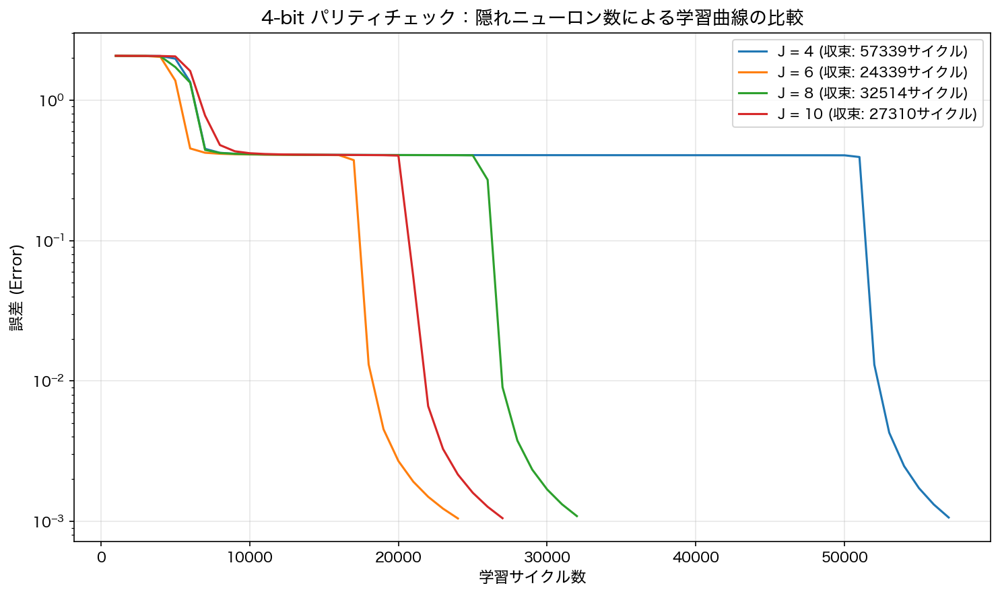
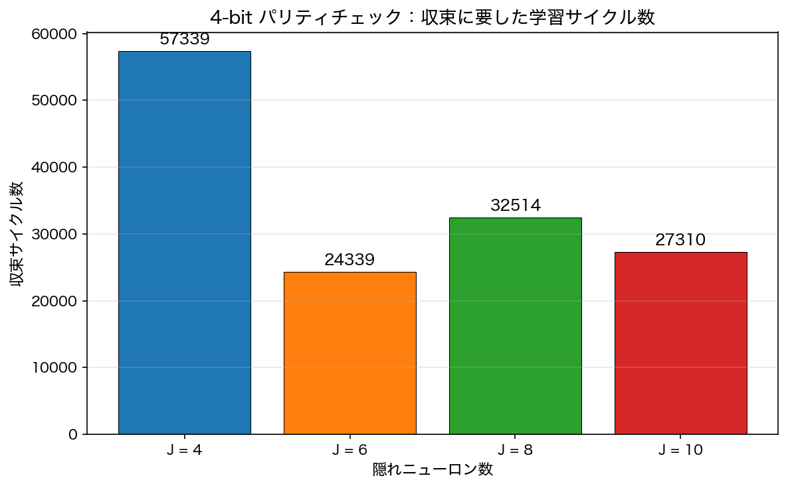
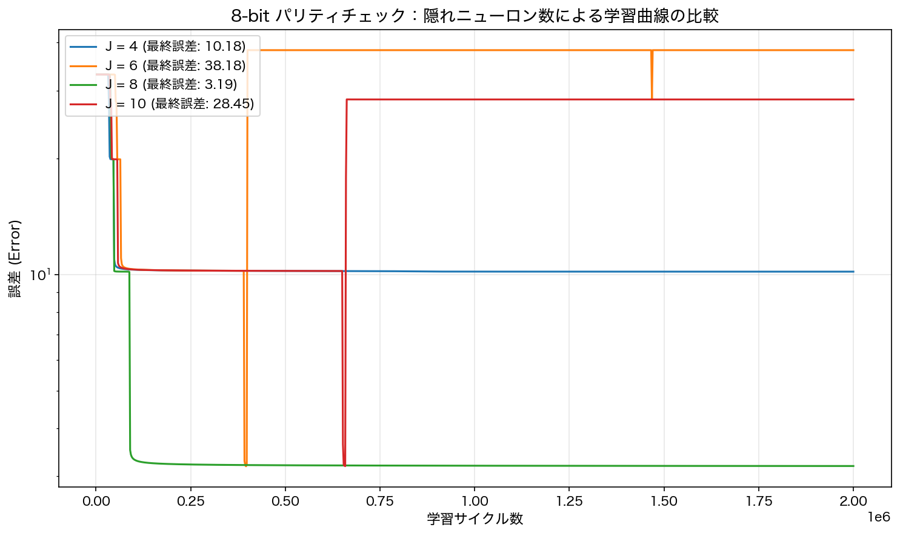
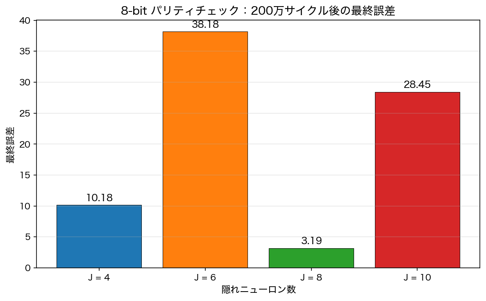
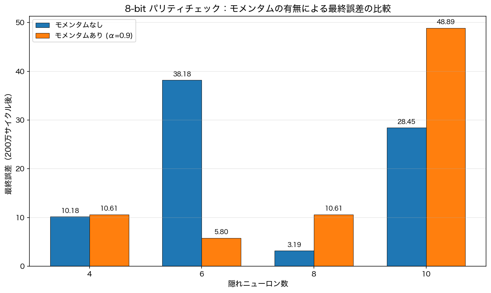

# Team Project 2 of CSA01 — バックプロパゲーションによるパリティチェック問題

科目: ニューラルネットワーク (CSA01)

チームメンバー:

| 名前 | 学籍番号 |
|------|--------|
| 佐藤 丞 | m5301059 |
| 宇佐美 雄貴 | m5301073 |
| 関根 健人 | m5301060 |
| 相澤 祐真 | m5301001 |
| 渡部 千歳 | m5301074 |

## a) 解いた問題

課題として与えられた4-bitパリティチェック問題を、BPアルゴリズム（バックプロパゲーション）を用いたニューラルネットワークで解いた。パリティチェック問題とは、与えられたビット列に含まれる1の個数が偶数か奇数かを判定する問題である。

- 入力数：5（4ビットの入力 + 1つのダミー入力 $x = -1$）
- 出力数：1
- 入力パターン数：$2^4 = 16$ 通り
- 出力の定義：入力中の1の個数が偶数なら出力 $d = 1$、奇数なら出力 $d = 0$
- 隠れニューロン数を4, 6, 8, 10と変化させて性能を比較する

なお、プログラム上の定数 `J` は、実際の隠れニューロン数にダミーニューロン1個を加えた値である。たとえば隠れニューロン数4のときは `#define J 5`（隠れニューロン4個 + ダミー1個）となる。以降、本レポートで「隠れニューロン数4」と書く場合は、ダミーを含まない実質的なニューロン数を指す。

### ソースコード（4-bit版）

隠れニューロン数4の場合のプログラムを以下に示す。隠れニューロン数を6, 8, 10に変更する場合は、`#define J` の値をそれぞれ7, 9, 11に変更して実行した。

```c
/*************************************************************/
/* C-program for BP algorithm (4-bit Parity Check)           */
/*************************************************************/
#include <stdio.h>
#include <stdlib.h>
#include <math.h>
#include <float.h>
#include <time.h>

#define I             5  /* 4ビットの入力 + 1つのダミー */
#define J             5  /* 隠れ層4個 + 1つのダミー */
#define K             1  /* 出力層 */
#define n_sample      16 /* 4ビットの全組み合わせ数 */
#define eta           0.5
#define lambda        1.0
#define desired_error 0.001
#define sigmoid(x)    (1.0/(1.0+exp(-lambda*x)))
#define frand()       (rand()%10000/10001.0)
#define randomize()   srand((unsigned int)time(NULL))

/* 4ビットの全入出力パターン定義 */
double x[n_sample][I]={
  {0,0,0,0,-1}, {0,0,0,1,-1}, {0,0,1,0,-1}, {0,0,1,1,-1},
  {0,1,0,0,-1}, {0,1,0,1,-1}, {0,1,1,0,-1}, {0,1,1,1,-1},
  {1,0,0,0,-1}, {1,0,0,1,-1}, {1,0,1,0,-1}, {1,0,1,1,-1},
  {1,1,0,0,-1}, {1,1,0,1,-1}, {1,1,1,0,-1}, {1,1,1,1,-1}
};

/* 1の数が偶数なら1、奇数なら0 */
double d[n_sample][K]={
  {1}, {0}, {0}, {1},
  {0}, {1}, {1}, {0},
  {0}, {1}, {1}, {0},
  {1}, {0}, {0}, {1}
};

double v[J][I],w[K][J];
double y[J];
double o[K];

void Initialization(void);
void FindHidden(int p);
void FindOutput(void);
void PrintResult(void);

int main(){
  int    i,j,k,p,q=0;
  double Error=DBL_MAX;
  double delta_o[K];
  double delta_y[J];

  Initialization();
  
  while(Error>desired_error && q < 1000000){
    q++;
    Error=0;
    for(p=0; p<n_sample; p++){
      FindHidden(p);
      FindOutput();

      for(k=0;k<K;k++){
        Error += 0.5*pow(d[p][k]-o[k], 2.0);
        delta_o[k]=(d[p][k]-o[k])*(1-o[k])*o[k];
      }
      
      for(j=0; j<J; j++){
        delta_y[j]=0;
        for(k=0;k<K;k++)
          delta_y[j]+=delta_o[k]*w[k][j];
        delta_y[j]=(1-y[j])*y[j]*delta_y[j];
      }
    
      for(k=0; k<K; k++)
        for(j=0; j<J; j++)
          w[k][j] += eta*delta_o[k]*y[j];
    
      for(j=0; j<J; j++)
        for(i=0; i<I; i++)
          v[j][i] += eta*delta_y[j]*x[p][i];
    }
    
    if (q % 1000 == 0) {
      printf("Error in the %d-th learning cycle = %f\n",q,Error);
    }
  } 
  
  printf("\nFinished at the %d-th learning cycle with Error = %f\n", q, Error);
  PrintResult();
  return 0;
}

void Initialization(void){
  int i,j,k;
  randomize();
  for(j=0; j<J; j++)
    for(i=0; i<I; i++)
      v[j][i] = frand()-0.5;
  for(k=0; k<K; k++)
    for(j=0; j<J; j++)
      w[k][j] = frand()-0.5;
}

void FindHidden(int p){
  int    i,j;
  double temp;
  for(j=0;j<J-1;j++){
    temp=0;
    for(i=0;i<I;i++)
      temp+=v[j][i]*x[p][i];
    y[j]=sigmoid(temp);
  }
  y[J-1]=-1;
}

void FindOutput(void){
  int    j,k;
  double temp;
  for(k=0;k<K;k++){
    temp=0;
    for(j=0;j<J;j++)
      temp += w[k][j]*y[j];
    o[k]=sigmoid(temp);
  }
}

void PrintResult(void){
  int i,j,k;
  printf("\n\nThe connection weights in the output layer:\n");
  for(k=0; k<K; k++){
    for(j=0; j<J; j++)
      printf("%5f ",w[k][j]);
    printf("\n");
  }
  printf("\n\nThe connection weights in the hidden layer:\n");
  for(j=0; j<J-1; j++){
    for(i=0; i<I; i++)
      printf("%5f ",v[j][i]);
    printf("\n");
  }
  printf("\n\n");
}
```

---

## b) 使用した手法

3層フィードフォワードニューラルネットワーク（入力層・隠れ層・出力層）に対して、授業で扱ったBPアルゴリズム（誤差逆伝播法）を適用した。

### ネットワーク構造

| 要素 | 値 |
|------|-----|
| 入力層ニューロン数 | 5（4入力 + ダミー） |
| 隠れニューロン数 | 4, 6, 8, 10（それぞれダミー1個を加えた値がプログラム上の `J`） |
| 出力層ニューロン数 | 1 |
| 学習率 $\eta$ | 0.5 |
| シグモイド関数の傾き $\lambda$ | 1.0 |
| 収束判定閾値 | 0.001 |

### 学習の手順

1. **重みの初期化**: 入力層-隠れ層間の重み $v_{ji}$ と隠れ層-出力層間の重み $w_{kj}$ を $[-0.5, 0.5)$ の一様乱数で初期化する。

2. **順伝播**: 各サンプル $p$ に対して隠れ層の出力 $y_j$ と出力層の出力 $o_k$ を計算する。
   - 隠れ層: $y_j = \sigma\left(\sum_{i} v_{ji} x_i^{(p)}\right)$（ただし最後の隠れニューロンはダミー $y_{J-1} = -1$）
   - 出力層: $o_k = \sigma\left(\sum_{j} w_{kj} y_j\right)$
   - ここで $\sigma(x) = \frac{1}{1 + e^{-\lambda x}}$ はシグモイド関数である。

3. **誤差の計算**: 二乗誤差 $E = \sum_p \sum_k \frac{1}{2}(d_k^{(p)} - o_k)^2$ を累積する。

4. **誤差逆伝播**: 出力層と隠れ層のデルタを計算する。
   - 出力層: $\delta_k^{(o)} = (d_k - o_k) \cdot o_k (1 - o_k)$
   - 隠れ層: $\delta_j^{(y)} = y_j (1 - y_j) \sum_k \delta_k^{(o)} w_{kj}$

5. **重みの更新**: 勾配降下法により各重みを更新する。
   - $w_{kj} \leftarrow w_{kj} + \eta \cdot \delta_k^{(o)} \cdot y_j$
   - $v_{ji} \leftarrow v_{ji} + \eta \cdot \delta_j^{(y)} \cdot x_i^{(p)}$

6. 上記を全サンプルについて繰り返し（オンライン学習）、累積誤差 $E$ が収束閾値 0.001 以下になるまで学習サイクルを反復する。

---

## c) シミュレーション結果と考察

隠れニューロン数を4, 6, 8, 10と変化させた場合の学習曲線を以下に示す。





### 収束結果のまとめ

| 隠れニューロン数 | 収束サイクル数 | 収束の有無 |
|:---:|:---:|:---:|
| 4 | 57,339 | 収束 |
| 6 | 24,339 | 収束 |
| 8 | 32,514 | 収束 |
| 10 | 27,310 | 収束 |

### 考察

4-bitパリティチェック問題では、全ての隠れニューロン数で最終的に収束した。ただし、収束に要するサイクル数にはかなりの差がある。

隠れニューロン数4の場合は約57,000サイクルと最も多くの反復が必要だった。パリティチェック問題は線形分離不可能な問題なので、隠れニューロンが少ないと誤差曲面上の局所解に長く留まりやすく、そこから抜け出すのに時間がかかったと考えられる。一方、隠れニューロン数6の場合は約24,000サイクルで最も早く収束しており、4-bit問題に対してちょうどよいネットワークサイズだったといえる。

学習曲線を見ると、どの条件でも初期に誤差が約2.0付近で停滞するプラトー（平坦領域）が現れている。これはシグモイド関数の飽和領域に重みが入ることで勾配が非常に小さくなり、重みの更新がほとんど進まなくなる現象である。このプラトーからいつ抜け出せるかが収束の速さを大きく左右しており、隠れニューロン数6が最も早くプラトーを脱出したことがグラフから読み取れる。

また、隠れニューロン数を8に増やしても6より収束が遅くなっている点が興味深い。ニューロン数を増やすとネットワークの表現力は上がるが、その分パラメータ空間が大きくなり、探索が非効率になる。さらに初期値への依存性も高まるため、ニューロン数を増やせば必ず速く収束するとは限らないことがわかる。

---

## d) チームが提案した新しい問題

4-bit問題の発展として、**8-bitパリティチェック問題**に同じBPアルゴリズムを適用し、問題の規模拡大がネットワークの学習にどう影響するかを調べた。

- 入力数：9（8ビットの入力 + 1つのダミー入力）
- 出力数：1
- 入力パターン数：$2^8 = 256$ 通り
- 出力の定義：4-bit問題と同一（偶数パリティなら1、奇数パリティなら0）

8-bit版のプログラムを作るにあたり、4-bit版に以下の変更を加えた。

**入力パターンの自動生成**: 4-bit版では16パターンを配列に直接書いていたが、8-bitでは256パターンになるため、ビット演算で自動生成するように変更した。

```c
for (p = 0; p < n_sample; p++) {
    int count = 0;
    for (i = 0; i < 8; i++) {
        x[p][i] = (p >> i) & 1; // pのiビット目を取り出す
        if (x[p][i] == 1) count++;
    }
    x[p][8] = -1; // ダミー入力
    d[p][0] = (count % 2 == 0) ? 1 : 0;
}
```

**学習サイクル上限の増加**: パターン数が16倍に増えるため、上限を100万から200万サイクルに引き上げた。

**ネットワーク構造の変更**: 入力層のニューロン数を5（4+ダミー）から9（8+ダミー）に増加させた。隠れ層と出力層の構造はそのまま維持し、隠れニューロン数は4-bitと同様に4, 6, 8, 10で比較した。

### 8-bit版ソースコード

隠れニューロン数4の場合のプログラム全文を以下に示す。隠れニューロン数を6, 8, 10に変更する場合は、`#define J` の値をそれぞれ7, 9, 11に変更して実行した。

```c
/*************************************************************/
/* C-program for BP algorithm (8-bit Parity Check)           */
/*************************************************************/
#include <stdio.h>
#include <stdlib.h>
#include <math.h>
#include <float.h>
#include <time.h>

#define I             9   /* 8ビットの入力 + 1つのダミー */
#define J             5   /* 隠れ層4個 + 1つのダミー */
#define K             1   /* 出力層 */
#define n_sample      256 /* 8ビットの全組み合わせ数 (2^8) */
#define eta           0.5
#define lambda        1.0
#define desired_error 0.001
#define sigmoid(a)    (1.0/(1.0+exp(-lambda*(a))))
#define frand()       (rand()%10000/10001.0)
#define randomize()   srand((unsigned int)time(NULL))

double x[n_sample][I];
double d[n_sample][K];
double v[J][I], w[K][J];
double y[J], o[K];

void Initialization(void);
void FindHidden(int p);
void FindOutput(void);

int main() {
  int i, j, k, p, q = 0;
  double Error = DBL_MAX;
  double delta_o[K], delta_y[J];

  for (p = 0; p < n_sample; p++) {
    int count = 0;
    for (i = 0; i < 8; i++) {
      x[p][i] = (p >> i) & 1;
      if (x[p][i] == 1) count++;
    }
    x[p][8] = -1;
    d[p][0] = (count % 2 == 0) ? 1 : 0;
  }

  Initialization();
  while (Error > desired_error && q < 2000000) {
    q++; Error = 0;
    for (p = 0; p < n_sample; p++) {
      FindHidden(p); FindOutput();
      for (k = 0; k < K; k++) {
        Error += 0.5 * pow(d[p][k] - o[k], 2.0);
        delta_o[k] = (d[p][k] - o[k]) * (1 - o[k]) * o[k];
      }
      for (j = 0; j < J; j++) {
        delta_y[j] = 0;
        for (k = 0; k < K; k++) delta_y[j] += delta_o[k] * w[k][j];
        delta_y[j] = (1 - y[j]) * y[j] * delta_y[j];
      }
      for (k = 0; k < K; k++)
        for (j = 0; j < J; j++) w[k][j] += eta * delta_o[k] * y[j];
      for (j = 0; j < J; j++)
        for (i = 0; i < I; i++) v[j][i] += eta * delta_y[j] * x[p][i];
    }
    if (q % 2000 == 0) printf("Error in the %d-th learning cycle = %f\n", q, Error);
  }
  printf("\nFinished at the %d-th learning cycle with Error = %f\n", q, Error);
  return 0;
}

void Initialization(void) {
  int i, j, k;
  randomize();
  for (j = 0; j < J; j++) for (i = 0; i < I; i++) v[j][i] = frand() - 0.5;
  for (k = 0; k < K; k++) for (j = 0; j < J; j++) w[k][j] = frand() - 0.5;
}
void FindHidden(int p) {
  int i, j; double temp;
  for (j = 0; j < J - 1; j++) {
    temp = 0; for (i = 0; i < I; i++) temp += v[j][i] * x[p][i];
    y[j] = sigmoid(temp);
  }
  y[J - 1] = -1;
}
void FindOutput(void) {
  int j, k; double temp;
  for (k = 0; k < K; k++) {
    temp = 0; for (j = 0; j < J; j++) temp += w[k][j] * y[j];
    o[k] = sigmoid(temp);
  }
}
```

### 8-bit問題のシミュレーション結果

8-bitパリティチェック問題に対して、隠れニューロン数を4, 6, 8, 10と変えてシミュレーションを行った。最大学習サイクル数は200万回である。





| 隠れニューロン数 | 最終誤差（200万サイクル後） | 収束の有無 |
|:---:|:---:|:---:|
| 4 | 10.18 | 未収束 |
| 6 | 38.18 | 未収束 |
| 8 | 3.19 | 未収束 |
| 10 | 28.45 | 未収束 |

8-bit問題では、いずれの隠れニューロン数でも200万サイクル以内に収束しなかった。4-bitでは全条件で収束したことと比べると大きく異なる結果である。8-bit問題は入力パターンが256と4-bitの16倍になり、入力空間の次元も5から9に増える。パリティ関数は全てのビットの情報を統合する高度に非線形な関数なので、パターン数と次元が増えると学習の難易度が急激に上がる。

学習曲線を見ると、誤差が段階的にステップ状に下降する特徴がある。これは256パターンのうちいくつかのグループを正しく分類できるようになるたびに、誤差がまとまって減少しているためと考えられる。隠れニューロン数8が最終誤差3.19と最も良い結果を示したが、収束には至らなかった。

この結果から、8-bit問題を収束させるにはモメンタム項の導入などBPアルゴリズム自体の改良が必要ではないかと考え、次のe)で検討した。

---

## e) 手法の改良：モメンタム項の導入

### 改良の動機

d)の8-bit問題の結果から、通常のBPアルゴリズムでは誤差曲面上の局所解やプラトーに捕まりやすく、収束が困難であることがわかった。この問題を緩和するために、重みの更新式にモメンタム項を導入した。

### モメンタム付きBPアルゴリズム

通常のBPアルゴリズムでは重みの更新が以下のように行われる：

$$\Delta w_{kj}(t) = \eta \cdot \delta_k \cdot y_j$$

モメンタム項を導入すると、前回の重み更新量を慣性として加える：

$$\Delta w_{kj}(t) = \eta \cdot \delta_k \cdot y_j + \alpha \cdot \Delta w_{kj}(t-1)$$

ここで $\alpha$ はモメンタム係数であり、今回は $\alpha = 0.9$ に設定した。モメンタム項には以下の効果が期待される：

- プラトー領域で勾配が小さくなっても、過去の更新の慣性により重みの更新が継続される
- 局所解からの脱出が容易になる
- 誤差曲面上の谷に沿った方向への移動が加速される

### 実装の変更点

前回の重み更新量を保持する配列 `dw[K][J]` と `dv[J][I]` を新たに追加し、重み更新の部分を以下のように変更した。

```c
#define alpha 0.9  /* モメンタム係数 */
double dv[J][I], dw[K][J]; /* 前回の重み更新量 */

/* 重み更新（モメンタム付き） */
for (k = 0; k < K; k++)
  for (j = 0; j < J; j++) {
    change = eta * delta_o[k] * y[j] + alpha * dw[k][j];
    w[k][j] += change;
    dw[k][j] = change;
  }
for (j = 0; j < J; j++)
  for (i = 0; i < I; i++) {
    change = eta * delta_y[j] * x[p][i] + alpha * dv[j][i];
    v[j][i] += change;
    dv[j][i] = change;
  }
```

その他のパラメータ（学習率 $\eta = 0.5$、$\lambda = 1.0$、収束閾値0.001、最大200万サイクル）は通常版と同一とした。

---

## f) 新しいシミュレーションの結果と考察

モメンタム付きBPアルゴリズムを8-bitパリティチェック問題に適用し、隠れニューロン数4, 6, 8, 10で通常版と比較した。



### 結果のまとめ

| 隠れニューロン数 | 通常BP（最終誤差） | モメンタム付き（最終誤差） |
|:---:|:---:|:---:|
| 4 | 10.18 | 10.61 |
| 6 | 38.18 | 5.80 |
| 8 | 3.19 | 10.61 |
| 10 | 28.45 | 48.89 |

いずれの条件でも200万サイクル以内の収束は達成されなかった。

### 考察

モメンタム項の導入によって結果が改善された条件と悪化した条件がある。隠れニューロン数6の場合、通常BPでは38.18だった最終誤差がモメンタム付きでは5.80に大幅に改善された。一方で、隠れニューロン数8では通常BPの3.19に対してモメンタム付きでは10.61と悪化し、隠れニューロン数10でも28.45から48.89に悪化した。

この結果は、モメンタム項の効果が一様ではないことを示している。モメンタム係数 $\alpha = 0.9$ はかなり大きい値であり、勢いがつきすぎて良い解を通り越してしまう（オーバーシュート）場合がある。特にパラメータ空間が大きいほど（隠れニューロン数が多いほど）、この振動が不安定になりやすい。隠れニューロン数6の場合は適度なパラメータ空間サイズだったため、モメンタムの加速効果が局所解からの脱出に寄与したと考えられる。

8-bit問題はどの条件でも収束に至らなかったことから、パリティチェック問題の難易度はビット数に対して指数的に増大し、モメンタムのような単純な改良だけでは対処しきれないことがわかった。収束を実現するには、隠れニューロン数の大幅な増加、適応的学習率（AdaGradやAdamなど）の導入、あるいはネットワーク構造自体の再設計が必要だろう。

### 4-bit問題と8-bit問題の全体的な比較

| | 4-bit（通常BP） | 8-bit（通常BP） | 8-bit（モメンタム付き） |
|---|---|---|---|
| 入力パターン数 | 16 | 256 | 256 |
| 最良の最終誤差 | 0.001（全条件で達成） | 3.19（隠れニューロン数8） | 5.80（隠れニューロン数6） |
| 収束の有無 | 全条件で収束 | 全条件未収束 | 全条件未収束 |

以上の結果から、(1) 4-bitパリティチェック問題はBPアルゴリズムで十分に解ける問題であること、(2) 隠れニューロン数は多ければよいというわけではなく問題に対して適切な数があること、(3) 問題の規模が大きくなると通常のBPでは対処しきれないこと、(4) モメンタム項の導入は条件によって効果が異なり、万能な改善策ではないこと、が確認できた。
