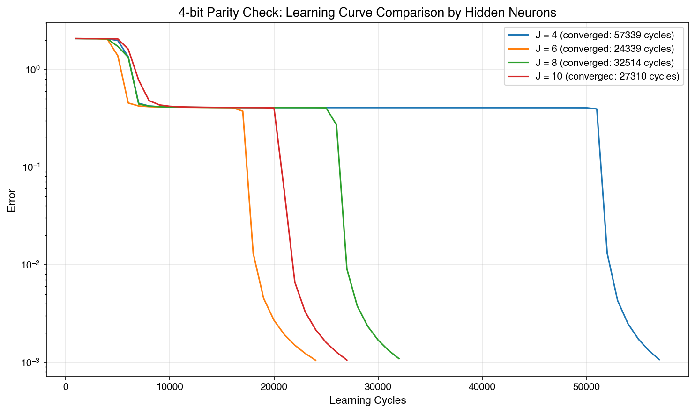
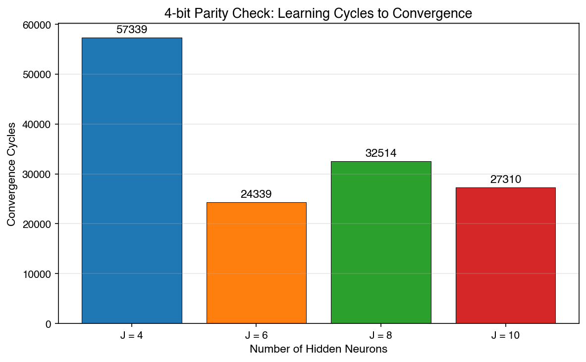
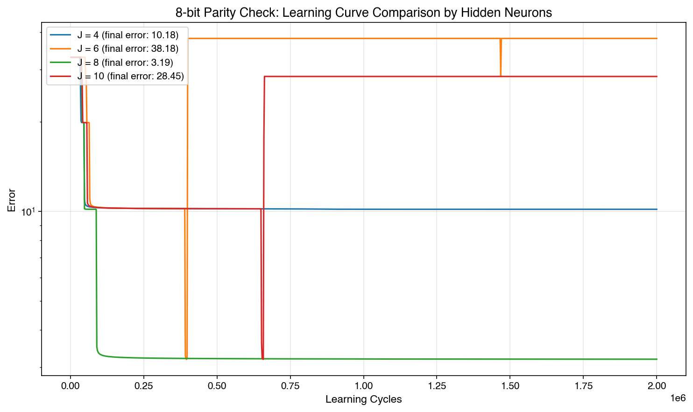
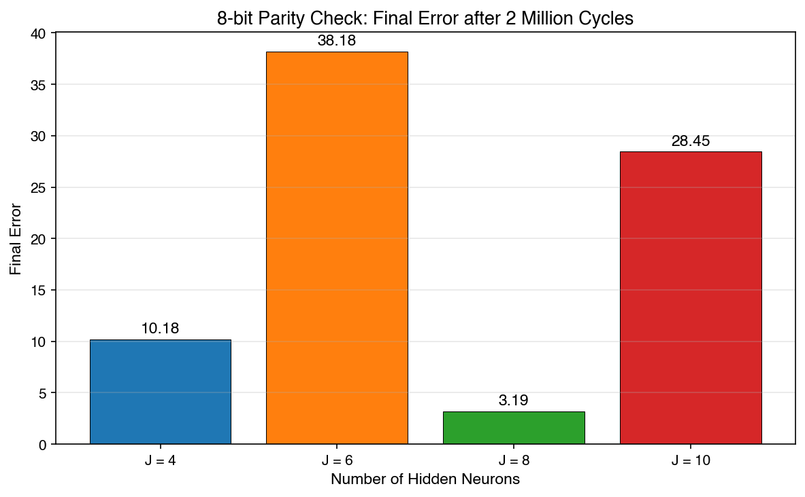
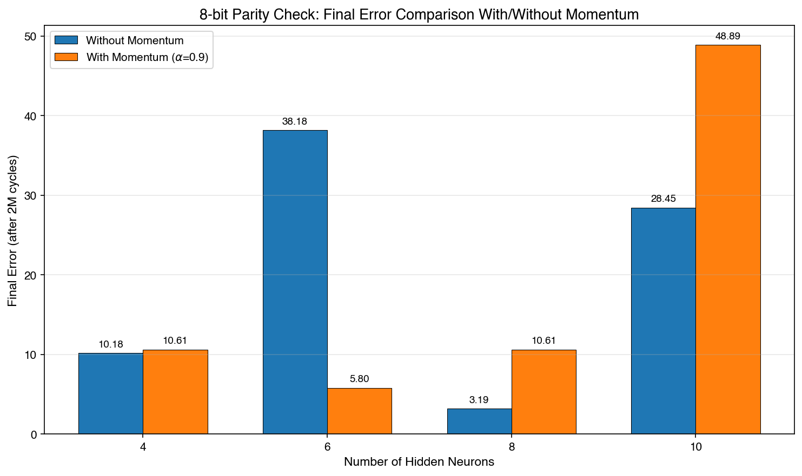

# Team Project 2 of CSA01 — Parity Check Problem Using Backpropagation

Course: Neural Networks (CSA01)

Team Members:

| Name | Student ID |
|------|-----------|
| Sho SATO | m5301059 |
| Yuki USAMI | m5301073 |
| Kento SEKINE | m5301060 |
| Yuma AIZAWA | m5301001 |
| Chitose WATABE | m5301074 |

## a) Problem Solved

We solved the 4-bit parity check problem, which was given as a class assignment, using a neural network trained with the BP (Backpropagation) algorithm. The parity check problem requires determining whether the number of ones in a given bit string is even or odd.

- Number of inputs: 5 (4-bit inputs + 1 dummy input $x = -1$)
- Number of outputs: 1
- Number of input patterns: $2^4 = 16$
- Output definition: output $d = 1$ if the number of ones is even; $d = 0$ if odd
- Performance was compared by varying the number of hidden neurons from 4 to 10 (step size 2)

Note that the constant `J` in the program equals the actual number of hidden neurons plus one dummy neuron. For example, when using 4 hidden neurons, the code has `#define J 5` (4 hidden neurons + 1 dummy). Throughout this report, "4 hidden neurons" refers to the actual neuron count excluding the dummy.

### Source Code (4-bit version)

The program for 4 hidden neurons is shown below. To change the number of hidden neurons to 6, 8, or 10, the value of `#define J` was changed to 7, 9, or 11 respectively.

```c
/*************************************************************/
/* C-program for BP algorithm (4-bit Parity Check)           */
/*************************************************************/
#include <stdio.h>
#include <stdlib.h>
#include <math.h>
#include <float.h>
#include <time.h>

#define I             5  /* 4-bit inputs + 1 dummy */
#define J             5  /* 4 hidden neurons + 1 dummy */
#define K             1  /* output layer */
#define n_sample      16 /* all 4-bit combinations */
#define eta           0.5
#define lambda        1.0
#define desired_error 0.001
#define sigmoid(x)    (1.0/(1.0+exp(-lambda*x)))
#define frand()       (rand()%10000/10001.0)
#define randomize()   srand((unsigned int)time(NULL))

/* All 4-bit input/output patterns */
double x[n_sample][I]={
  {0,0,0,0,-1}, {0,0,0,1,-1}, {0,0,1,0,-1}, {0,0,1,1,-1},
  {0,1,0,0,-1}, {0,1,0,1,-1}, {0,1,1,0,-1}, {0,1,1,1,-1},
  {1,0,0,0,-1}, {1,0,0,1,-1}, {1,0,1,0,-1}, {1,0,1,1,-1},
  {1,1,0,0,-1}, {1,1,0,1,-1}, {1,1,1,0,-1}, {1,1,1,1,-1}
};

/* Output: 1 if number of ones is even, 0 if odd */
double d[n_sample][K]={
  {1}, {0}, {0}, {1},
  {0}, {1}, {1}, {0},
  {0}, {1}, {1}, {0},
  {1}, {0}, {0}, {1}
};

double v[J][I],w[K][J];
double y[J];
double o[K];

void Initialization(void);
void FindHidden(int p);
void FindOutput(void);
void PrintResult(void);

int main(){
  int    i,j,k,p,q=0;
  double Error=DBL_MAX;
  double delta_o[K];
  double delta_y[J];

  Initialization();
  
  while(Error>desired_error && q < 1000000){
    q++;
    Error=0;
    for(p=0; p<n_sample; p++){
      FindHidden(p);
      FindOutput();

      for(k=0;k<K;k++){
        Error += 0.5*pow(d[p][k]-o[k], 2.0);
        delta_o[k]=(d[p][k]-o[k])*(1-o[k])*o[k];
      }
      
      for(j=0; j<J; j++){
        delta_y[j]=0;
        for(k=0;k<K;k++)
          delta_y[j]+=delta_o[k]*w[k][j];
        delta_y[j]=(1-y[j])*y[j]*delta_y[j];
      }
    
      for(k=0; k<K; k++)
        for(j=0; j<J; j++)
          w[k][j] += eta*delta_o[k]*y[j];
    
      for(j=0; j<J; j++)
        for(i=0; i<I; i++)
          v[j][i] += eta*delta_y[j]*x[p][i];
    }
    
    if (q % 1000 == 0) {
      printf("Error in the %d-th learning cycle = %f\n",q,Error);
    }
  } 
  
  printf("\nFinished at the %d-th learning cycle with Error = %f\n", q, Error);
  PrintResult();
  return 0;
}

void Initialization(void){
  int i,j,k;
  randomize();
  for(j=0; j<J; j++)
    for(i=0; i<I; i++)
      v[j][i] = frand()-0.5;
  for(k=0; k<K; k++)
    for(j=0; j<J; j++)
      w[k][j] = frand()-0.5;
}

void FindHidden(int p){
  int    i,j;
  double temp;
  for(j=0;j<J-1;j++){
    temp=0;
    for(i=0;i<I;i++)
      temp+=v[j][i]*x[p][i];
    y[j]=sigmoid(temp);
  }
  y[J-1]=-1;
}

void FindOutput(void){
  int    j,k;
  double temp;
  for(k=0;k<K;k++){
    temp=0;
    for(j=0;j<J;j++)
      temp += w[k][j]*y[j];
    o[k]=sigmoid(temp);
  }
}

void PrintResult(void){
  int i,j,k;
  printf("\n\nThe connection weights in the output layer:\n");
  for(k=0; k<K; k++){
    for(j=0; j<J; j++)
      printf("%5f ",w[k][j]);
    printf("\n");
  }
  printf("\n\nThe connection weights in the hidden layer:\n");
  for(j=0; j<J-1; j++){
    for(i=0; i<I; i++)
      printf("%5f ",v[j][i]);
    printf("\n");
  }
  printf("\n\n");
}
```

---

## b) Method Used

The BP algorithm (error backpropagation), as covered in the lectures, was applied to a 3-layer feedforward neural network (input layer, hidden layer, output layer).

### Network Structure

| Parameter | Value |
|-----------|-------|
| Input neurons | 5 (4 inputs + dummy) |
| Hidden neurons | 4, 6, 8, 10 (the program constant `J` includes +1 for the dummy) |
| Output neurons | 1 |
| Learning rate $\eta$ | 0.5 |
| Sigmoid slope $\lambda$ | 1.0 |
| Convergence threshold | 0.001 |

### Learning Procedure

1. **Weight initialization**: The weights $v_{ji}$ (input-to-hidden) and $w_{kj}$ (hidden-to-output) are initialized with uniform random values in $[-0.5, 0.5)$.

2. **Forward propagation**: For each sample $p$, compute the hidden layer output $y_j$ and the output layer output $o_k$.
   - Hidden layer: $y_j = \sigma\left(\sum_{i} v_{ji} x_i^{(p)}\right)$ (the last hidden neuron is a dummy with $y_{J-1} = -1$)
   - Output layer: $o_k = \sigma\left(\sum_{j} w_{kj} y_j\right)$
   - where $\sigma(x) = \frac{1}{1 + e^{-\lambda x}}$ is the sigmoid function.

3. **Error computation**: Accumulate the squared error $E = \sum_p \sum_k \frac{1}{2}(d_k^{(p)} - o_k)^2$.

4. **Error backpropagation**: Compute the deltas for the output and hidden layers.
   - Output layer: $\delta_k^{(o)} = (d_k - o_k) \cdot o_k (1 - o_k)$
   - Hidden layer: $\delta_j^{(y)} = y_j (1 - y_j) \sum_k \delta_k^{(o)} w_{kj}$

5. **Weight update**: Update each weight using gradient descent.
   - $w_{kj} \leftarrow w_{kj} + \eta \cdot \delta_k^{(o)} \cdot y_j$
   - $v_{ji} \leftarrow v_{ji} + \eta \cdot \delta_j^{(y)} \cdot x_i^{(p)}$

6. The above steps are repeated for all samples (online learning), and the learning cycles continue until the cumulative error $E$ falls below the convergence threshold of 0.001.

---

## c) Simulation Results and Discussion

The learning curves for hidden neuron counts of 4, 6, 8, and 10 are shown below.





### Summary of Convergence Results

| Hidden Neurons | Convergence Cycles | Converged? |
|:---:|:---:|:---:|
| 4 | 57,339 | Yes |
| 6 | 24,339 | Yes |
| 8 | 32,514 | Yes |
| 10 | 27,310 | Yes |

### Discussion

In the 4-bit parity check problem, convergence was achieved for all hidden neuron counts. However, the number of cycles required for convergence varied considerably.

With 4 hidden neurons, approximately 57,000 cycles were needed, which was the slowest. Since the parity check problem is linearly inseparable, fewer hidden neurons make the network more likely to get stuck in local minima on the error surface, taking longer to escape. On the other hand, 6 hidden neurons converged fastest at about 24,000 cycles, suggesting this was an appropriate network size for the 4-bit problem.

Looking at the learning curves, all conditions exhibit a plateau where the error stagnates around 2.0 in the early stages. This occurs because the weights enter the saturation region of the sigmoid function, making the gradients very small and stalling the weight updates. When the network escapes from this plateau largely determines how quickly it converges, and the graphs show that 6 hidden neurons escaped the plateau earliest.

It is also interesting that increasing the hidden neurons to 8 resulted in slower convergence than 6. While more neurons increase the network's representational capacity, they also expand the parameter space, making the search less efficient. Additionally, the sensitivity to initial values increases, so more neurons do not always guarantee faster convergence.

---

## d) New Problem Proposed by the Team

As an extension of the 4-bit problem, we applied the same BP algorithm to the **8-bit parity check problem** to investigate how scaling up the problem size affects network learning.

- Number of inputs: 9 (8-bit inputs + 1 dummy input)
- Number of outputs: 1
- Number of input patterns: $2^8 = 256$
- Output definition: same as the 4-bit problem (output 1 for even parity, 0 for odd)

The following modifications were made to the 4-bit program to handle the 8-bit problem.

**Automatic input pattern generation**: In the 4-bit version, the 16 input patterns were written directly in arrays. For the 8-bit version with 256 patterns, we switched to automatic generation using bitwise operations.

```c
for (p = 0; p < n_sample; p++) {
    int count = 0;
    for (i = 0; i < 8; i++) {
        x[p][i] = (p >> i) & 1; // extract the i-th bit of p
        if (x[p][i] == 1) count++;
    }
    x[p][8] = -1; // dummy input
    d[p][0] = (count % 2 == 0) ? 1 : 0;
}
```

**Increased maximum learning cycles**: Since the number of patterns increases 16-fold, the maximum cycle limit was raised from 1 million to 2 million.

**Network structure changes**: The number of input layer neurons was increased from 5 (4 + dummy) to 9 (8 + dummy). The hidden layer and output layer structures were kept unchanged, and the number of hidden neurons was compared at 4, 6, 8, and 10, as with the 4-bit problem.

### 8-bit Source Code

The complete program for 4 hidden neurons is shown below. To change the number of hidden neurons to 6, 8, or 10, the value of `#define J` was changed to 7, 9, or 11 respectively.

```c
/*************************************************************/
/* C-program for BP algorithm (8-bit Parity Check)           */
/*************************************************************/
#include <stdio.h>
#include <stdlib.h>
#include <math.h>
#include <float.h>
#include <time.h>

#define I             9   /* 8-bit inputs + 1 dummy */
#define J             5   /* 4 hidden neurons + 1 dummy */
#define K             1   /* output layer */
#define n_sample      256 /* all 8-bit combinations (2^8) */
#define eta           0.5
#define lambda        1.0
#define desired_error 0.001
#define sigmoid(a)    (1.0/(1.0+exp(-lambda*(a))))
#define frand()       (rand()%10000/10001.0)
#define randomize()   srand((unsigned int)time(NULL))

double x[n_sample][I];
double d[n_sample][K];
double v[J][I], w[K][J];
double y[J], o[K];

void Initialization(void);
void FindHidden(int p);
void FindOutput(void);

int main() {
  int i, j, k, p, q = 0;
  double Error = DBL_MAX;
  double delta_o[K], delta_y[J];

  for (p = 0; p < n_sample; p++) {
    int count = 0;
    for (i = 0; i < 8; i++) {
      x[p][i] = (p >> i) & 1;
      if (x[p][i] == 1) count++;
    }
    x[p][8] = -1;
    d[p][0] = (count % 2 == 0) ? 1 : 0;
  }

  Initialization();
  while (Error > desired_error && q < 2000000) {
    q++; Error = 0;
    for (p = 0; p < n_sample; p++) {
      FindHidden(p); FindOutput();
      for (k = 0; k < K; k++) {
        Error += 0.5 * pow(d[p][k] - o[k], 2.0);
        delta_o[k] = (d[p][k] - o[k]) * (1 - o[k]) * o[k];
      }
      for (j = 0; j < J; j++) {
        delta_y[j] = 0;
        for (k = 0; k < K; k++) delta_y[j] += delta_o[k] * w[k][j];
        delta_y[j] = (1 - y[j]) * y[j] * delta_y[j];
      }
      for (k = 0; k < K; k++)
        for (j = 0; j < J; j++) w[k][j] += eta * delta_o[k] * y[j];
      for (j = 0; j < J; j++)
        for (i = 0; i < I; i++) v[j][i] += eta * delta_y[j] * x[p][i];
    }
    if (q % 2000 == 0) printf("Error in the %d-th learning cycle = %f\n", q, Error);
  }
  printf("\nFinished at the %d-th learning cycle with Error = %f\n", q, Error);
  return 0;
}

void Initialization(void) {
  int i, j, k;
  randomize();
  for (j = 0; j < J; j++) for (i = 0; i < I; i++) v[j][i] = frand() - 0.5;
  for (k = 0; k < K; k++) for (j = 0; j < J; j++) w[k][j] = frand() - 0.5;
}
void FindHidden(int p) {
  int i, j; double temp;
  for (j = 0; j < J - 1; j++) {
    temp = 0; for (i = 0; i < I; i++) temp += v[j][i] * x[p][i];
    y[j] = sigmoid(temp);
  }
  y[J - 1] = -1;
}
void FindOutput(void) {
  int j, k; double temp;
  for (k = 0; k < K; k++) {
    temp = 0; for (j = 0; j < J; j++) temp += w[k][j] * y[j];
    o[k] = sigmoid(temp);
  }
}
```

### 8-bit Simulation Results

Simulations were conducted on the 8-bit parity check problem with 4, 6, 8, and 10 hidden neurons. The maximum number of learning cycles was set to 2 million.





| Hidden Neurons | Final Error (after 2M cycles) | Converged? |
|:---:|:---:|:---:|
| 4 | 10.18 | No |
| 6 | 38.18 | No |
| 8 | 3.19 | No |
| 10 | 28.45 | No |

None of the configurations converged within 2 million cycles. This is in stark contrast to the 4-bit case, where all configurations converged successfully. The 8-bit problem has $2^8 = 256$ input patterns, 16 times more than the 4-bit case, and the input space dimension increases from 5 to 9. Since the parity function is a highly nonlinear function that must integrate information from all bits, the learning difficulty increases dramatically as the number of patterns and dimensions grow.

The learning curves show a characteristic stepwise decrease in error. This suggests that each time the network learns to correctly classify a group of patterns out of the 256, the error decreases in discrete steps. Among the tested configurations, 8 hidden neurons achieved the smallest final error of 3.19, but still did not converge.

These results suggested that improvements to the BP algorithm itself, such as introducing a momentum term, might be necessary to achieve convergence on the 8-bit problem. This is explored in section e).

---

## e) Method Improvement: Introduction of Momentum Term

### Motivation

The results from the 8-bit problem in section d) showed that the standard BP algorithm tends to get trapped in local minima or plateaus on the error surface, making convergence difficult. To mitigate this problem, we introduced a momentum term into the weight update rule.

### BP Algorithm with Momentum

In the standard BP algorithm, weights are updated as follows:

$$\Delta w_{kj}(t) = \eta \cdot \delta_k \cdot y_j$$

With the momentum term, the previous weight update is added as inertia:

$$\Delta w_{kj}(t) = \eta \cdot \delta_k \cdot y_j + \alpha \cdot \Delta w_{kj}(t-1)$$

where $\alpha$ is the momentum coefficient, set to $\alpha = 0.9$ in this experiment. The momentum term is expected to have the following effects:

- Even when the gradient becomes small in plateau regions, the inertia from past updates keeps the weights moving
- Escape from local minima becomes easier
- Movement along valleys in the error surface is accelerated

### Implementation Changes

Arrays `dw[K][J]` and `dv[J][I]` were added to store the previous weight updates, and the weight update section was modified as follows.

```c
#define alpha 0.9  /* momentum coefficient */
double dv[J][I], dw[K][J]; /* previous weight updates */

/* Weight update (with momentum) */
for (k = 0; k < K; k++)
  for (j = 0; j < J; j++) {
    change = eta * delta_o[k] * y[j] + alpha * dw[k][j];
    w[k][j] += change;
    dw[k][j] = change;
  }
for (j = 0; j < J; j++)
  for (i = 0; i < I; i++) {
    change = eta * delta_y[j] * x[p][i] + alpha * dv[j][i];
    v[j][i] += change;
    dv[j][i] = change;
  }
```

All other parameters (learning rate $\eta = 0.5$, $\lambda = 1.0$, convergence threshold 0.001, maximum 2 million cycles) were kept identical to the standard version.

---

## f) New Simulation Results and Discussion

The BP algorithm with momentum was applied to the 8-bit parity check problem, and results were compared with the standard version for 4, 6, 8, and 10 hidden neurons.



### Summary of Results

| Hidden Neurons | Standard BP (Final Error) | With Momentum (Final Error) |
|:---:|:---:|:---:|
| 4 | 10.18 | 10.61 |
| 6 | 38.18 | 5.80 |
| 8 | 3.19 | 10.61 |
| 10 | 28.45 | 48.89 |

None of the configurations converged within 2 million cycles.

### Discussion

The introduction of the momentum term improved results for some conditions but worsened others. With 6 hidden neurons, the final error improved dramatically from 38.18 to 5.80. On the other hand, with 8 hidden neurons the error worsened from 3.19 to 10.61, and with 10 hidden neurons it worsened from 28.45 to 48.89.

These results show that the effect of the momentum term is not uniform. The momentum coefficient $\alpha = 0.9$ is quite large, and the accumulated inertia can cause the weights to overshoot good solutions. This oscillation tends to become more unstable as the parameter space grows larger (i.e., with more hidden neurons). With 6 hidden neurons, the parameter space was of a suitable size for the momentum's acceleration effect to help escape local minima.

Since the 8-bit problem did not converge under any condition, the difficulty of the parity check problem increases exponentially with the number of bits, and simple improvements like momentum alone are not sufficient. Achieving convergence would likely require a significantly larger number of hidden neurons, adaptive learning rate methods (such as AdaGrad or Adam), or a fundamental redesign of the network architecture.

### Overall Comparison of 4-bit and 8-bit Problems

| | 4-bit (Standard BP) | 8-bit (Standard BP) | 8-bit (With Momentum) |
|---|---|---|---|
| Input patterns | 16 | 256 | 256 |
| Best final error | 0.001 (achieved by all) | 3.19 (8 hidden neurons) | 5.80 (6 hidden neurons) |
| Convergence | All converged | None converged | None converged |

From these results, we confirmed that: (1) the 4-bit parity check problem can be adequately solved with the BP algorithm, (2) more hidden neurons are not always better — there is an appropriate number for each problem, (3) when the problem scale increases, the standard BP algorithm alone is insufficient, and (4) the introduction of the momentum term yields mixed results depending on the conditions, and is not a universal improvement.
