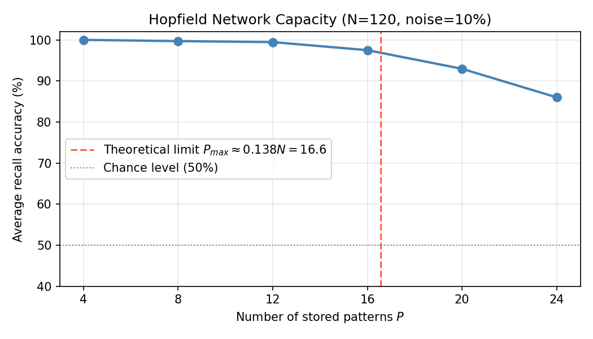

# CSA01 - Team Project 3, Part 1: Hopfield Neural Network

**Course:** Neural Networks (CSA01)  
**Team Members:**
- SATO Sho (m5301059)
- USAMI Yuki (m5301073)
- SEKINE Kento (m5301060)
- AIZAWA Yuma (m5301001)
- WATABE Chitose (m5301074)

---

## a) Problem Description

In this project, we implemented a **Hopfield neural network** as an autoassociative memory.
The network stores several binary pixel-art patterns and reconstructs them from corrupted (noisy) inputs.

The network consists of **120 neurons** arranged in a 10-row × 12-column grid.
We stored 4 digit patterns (0, 2, 4, and a custom pattern resembling 8) encoded in ±1 binary format, where −1 represents a lit pixel and +1 represents the background.

The experiment was conducted under three noise conditions:
- **0% noise** — the exact stored pattern is presented as input
- **10% noise** — approximately 12 out of 120 pixels are randomly flipped
- **15% noise** — approximately 18 out of 120 pixels are randomly flipped

---

## b) Network Architecture and Algorithm

### Hopfield Network Overview

A Hopfield network is a fully connected recurrent network of binary neurons.
Each neuron holds a state $s_i \in \{-1, +1\}$.
The network is used as an **energy-minimizing associative memory**: a noisy input pattern gradually descends the energy landscape until it settles at a stable attractor corresponding (ideally) to one of the stored memories.

### Hebbian Learning Rule (Weight Matrix)

The weight matrix is computed from the stored patterns $\{\boldsymbol{\xi}^\mu\}$ using the one-shot Hebbian rule:

$$W_{ij} = \frac{1}{N} \sum_{\mu=1}^{P} \xi_i^\mu \, \xi_j^\mu, \quad W_{ii} = 0$$

where $N = 120$ is the number of neurons, $P$ is the number of stored patterns, and the diagonal is forced to zero to prevent self-reinforcement.

### Asynchronous Update Rule

Recall is performed via **asynchronous update**: neurons are updated one at a time (in sequential order), using the current state of all other neurons:

$$s_i \leftarrow \text{sign}\!\left(\sum_{j \neq i} W_{ij} \, s_j\right)$$

where $\text{sign}(x) = +1$ if $x \geq 0$ and $-1$ if $x < 0$.

### Energy Function and Convergence

The network dynamics are governed by the Lyapunov energy function:

$$E = -\frac{1}{2} \sum_{i \neq j} W_{ij} \, s_i \, s_j$$

Each asynchronous update is guaranteed to decrease (or leave unchanged) the energy.
Therefore, the network always converges to a fixed point.

### Storage Capacity

The theoretical maximum number of patterns a Hopfield network can reliably store is approximately:

$$P_{\max} \approx 0.138 \times N = 0.138 \times 120 \approx 16 \text{ patterns}$$

Since we store only 4 patterns, the network is well below its capacity limit.

---

## c) Implementation

### Source Code: `hopfield_neural_network.c`

```c
/************************************************************************************/
/* c-Program for constructing an autoassociative memory                             */
/* The model is the Hopfield neural network with asynchorous update                 */
/* If you want to use it for applications other than that described                 */
/* in this project, please provide the patterns to be stored                        */
/*                                                                                  */
/* This program is produced by Qiangfu Zhao and extended by m5301059 SATO Sho.      */
/* You are free to use it for educational purpose                                   */
/************************************************************************************/
#include <stdlib.h>
#include <stdio.h>

#define n_neuron 120
#define n_pattern 4
#define n_row 10
#define n_column 12
#define noise_rate 0.20

int pattern[n_pattern][n_neuron] = {
    {1, 1, -1, -1, -1, -1, -1, -1, -1, -1, 1, 1,
     1, 1, -1, -1, -1, -1, -1, -1, -1, -1, 1, 1,
     1, 1, -1, -1, 1, 1, 1, 1, -1, -1, 1, 1,
     1, 1, -1, -1, 1, 1, 1, 1, -1, -1, 1, 1,
     1, 1, -1, -1, 1, 1, 1, 1, -1, -1, 1, 1,
     1, 1, -1, -1, 1, 1, 1, 1, -1, -1, 1, 1,
     1, 1, -1, -1, 1, 1, 1, 1, -1, -1, 1, 1,
     1, 1, -1, -1, 1, 1, 1, 1, -1, -1, 1, 1,
     1, 1, -1, -1, -1, -1, -1, -1, -1, -1, 1, 1,
     1, 1, -1, -1, -1, -1, -1, -1, -1, -1, 1, 1},
    {1, 1, -1, -1, -1, -1, -1, -1, -1, -1, 1, 1,
     1, 1, -1, -1, -1, -1, -1, -1, -1, -1, 1, 1,
     1, 1, 1, 1, 1, 1, 1, 1, -1, -1, 1, 1,
     1, 1, 1, 1, 1, 1, 1, 1, -1, -1, 1, 1,
     1, 1, -1, -1, -1, -1, -1, -1, -1, -1, 1, 1,
     1, 1, -1, -1, -1, -1, -1, -1, -1, -1, 1, 1,
     1, 1, -1, -1, 1, 1, 1, 1, 1, 1, 1, 1,
     1, 1, -1, -1, -1, -1, -1, -1, -1, -1, 1, 1,
     1, 1, -1, -1, -1, -1, -1, -1, -1, -1, 1, 1,
     1, 1, 1, 1, 1, 1, 1, 1, 1, 1, 1, 1},
    {1, 1, 1, 1, 1, -1, -1, 1, 1, 1, 1, 1,
     1, 1, 1, 1, -1, -1, -1, 1, 1, 1, 1, 1,
     1, 1, 1, -1, -1, -1, -1, 1, 1, 1, 1, 1,
     1, 1, -1, -1, 1, -1, -1, 1, 1, 1, 1, 1,
     1, -1, -1, 1, 1, -1, -1, 1, 1, 1, 1, 1,
     1, -1, -1, -1, -1, -1, -1, -1, -1, -1, 1, 1,
     1, -1, -1, -1, -1, -1, -1, -1, -1, -1, 1, 1,
     1, 1, 1, 1, 1, -1, -1, 1, 1, 1, 1, 1,
     1, 1, 1, 1, 1, -1, -1, 1, 1, 1, 1, 1,
     1, 1, 1, 1, 1, -1, -1, 1, 1, 1, 1, 1},
    {1, 1, 1, 1, 1, 1, 1, 1, 1, 1, 1, 1,
     1, -1, -1, -1, -1, -1, -1, -1, -1, -1, 1, 1,
     1, -1, -1, -1, -1, -1, -1, -1, -1, -1, 1, 1,
     1, -1, -1, 1, 1, 1, 1, 1, 1, 1, 1, 1,
     1, -1, -1, -1, -1, -1, -1, -1, -1, -1, 1, 1,
     1, -1, -1, -1, -1, -1, -1, -1, -1, -1, 1, 1,
     1, -1, -1, 1, 1, 1, 1, 1, -1, -1, 1, 1,
     1, -1, -1, 1, 1, 1, 1, 1, -1, -1, 1, 1,
     1, -1, -1, -1, -1, -1, -1, -1, -1, -1, 1, 1,
     1, -1, -1, -1, -1, -1, -1, -1, -1, -1, 1, 1}};

double w[n_neuron][n_neuron];
int v[n_neuron];

void Output_Pattern(int k)
{
    int i, j;
    printf("Pattern[%d]:\n", k);
    for (i = 0; i < n_row; i++)
    {
        for (j = 0; j < n_column; j++)
            printf("%2c", (pattern[k][i * n_column + j] == -1) ? '*' : ' ');
        printf("\n");
    }
    printf("\n\n\n");
    getchar();
}

void Output_State(int k)
{
    int i, j;
    printf("%d-th iteration:\n", k);
    for (i = 0; i < n_row; i++)
    {
        for (j = 0; j < n_column; j++)
            printf("%2c", (v[i * n_column + j] == -1) ? '*' : ' ');
        printf("\n");
    }
    printf("\n\n\n");
    getchar();
}

void Store_Pattern()
{
    int i, j, k;
    for (i = 0; i < n_neuron; i++)
    {
        for (j = 0; j < n_neuron; j++)
        {
            w[i][j] = 0;
            for (k = 0; k < n_pattern; k++)
                w[i][j] += pattern[k][i] * pattern[k][j];
            w[i][j] /= (double)n_pattern;
        }
        w[i][i] = 0;
    }
}

void Recall_Pattern(int m)
{
    int i, j, k;
    int n_update;
    double net; int vnew;
    double r;

    for (i = 0; i < n_neuron; i++)
    {
        r = (double)(rand() % 10001) / 10000.0;
        if (r < noise_rate)
            v[i] = (pattern[m][i] == 1) ? -1 : 1;
        else
            v[i] = pattern[m][i];
    }
    Output_State(0);

    k = 1;
    do
    {
        n_update = 0;
        for (i = 0; i < n_neuron; i++)
        {
            net = 0;
            for (j = 0; j < n_neuron; j++)
                net += w[i][j] * v[j];
            if (net >= 0)
                vnew = 1;
            if (net < 0)
                vnew = -1;
            if (vnew != v[i])
            {
                n_update++;
                v[i] = vnew;
            }
        }
        Output_State(k);
        k++;
    } while (n_update != 0);
}

void Initialization()
{
    int i, j;
    for (i = 0; i < n_neuron; i++)
        for (j = 0; j < n_neuron; j++)
            w[i][j] = 0;
}

int main()
{
    int k;
    for (k = 0; k < n_pattern; k++)
        Output_Pattern(k);
    Initialization();
    Store_Pattern();
    for (k = 0; k < n_pattern; k++)
        Recall_Pattern(k);
}
```

**Note on weight type:** The weight matrix `w` must be declared as `double`, not `int`.
With integer storage, the division `w[i][j] /= n_pattern` truncates fractional weights (e.g., a sum of 2 divided by 4 gives 0.5, which becomes 0 in integer arithmetic).
This would corrupt the weight matrix and degrade recall performance.

### Experiment Script: `run_experiment.sh`

To test each noise level automatically, we use the following script.
It compiles the program with the `noise_rate` macro substituted via `sed`, and feeds newlines to `stdin` to bypass the interactive `getchar()` prompts:

```bash
#!/bin/bash

SRC="hopfield_neural_network.c"
RESULTS_DIR="results"

mkdir -p "$RESULTS_DIR"

for noise in 0.00 0.10 0.15; do
    echo "=== noise_rate = $noise ==="

    sed "s/#define noise_rate.*/#define noise_rate $noise/" "$SRC" > /tmp/hopfield_tmp.c
    gcc -O2 -o /tmp/hopfield_exp /tmp/hopfield_tmp.c -lm
    if [ $? -ne 0 ]; then
        echo "Compile failed (noise=$noise)"
        continue
    fi

    OUT="$RESULTS_DIR/noise_$(echo "$noise" | tr '.' '_').txt"
    yes "" | /tmp/hopfield_exp > "$OUT" 2>&1
    echo "  -> $OUT"
done

echo "Done."
```

---

## d) Stored Patterns

The four patterns are encoded in ±1 format (`*` = −1 = lit pixel, ` ` = +1 = background).

**Pattern 0 — digit "0"**
```
     * * * * * * * *    
     * * * * * * * *    
     * *         * *    
     * *         * *    
     * *         * *    
     * *         * *    
     * *         * *    
     * *         * *    
     * * * * * * * *    
     * * * * * * * *    
```

**Pattern 1 — digit "2"**
```
     * * * * * * * *    
     * * * * * * * *    
                 * *    
                 * *    
     * * * * * * * *    
     * * * * * * * *    
     * *                
     * * * * * * * *    
     * * * * * * * *    
                        
```

**Pattern 2 — digit "4"**
```
           * *          
         * * *          
       * * * *          
     * *   * *          
   * *     * *          
   * * * * * * * * *    
   * * * * * * * * *    
           * *          
           * *          
           * *          
```

**Pattern 3 — digit "8" (custom)**
```
                        
   * * * * * * * * *    
   * * * * * * * * *    
   * *                  
   * * * * * * * * *    
   * * * * * * * * *    
   * *           * *    
   * *           * *    
   * * * * * * * * *    
   * * * * * * * * *    
```

---

## e) Experimental Results

The following tables summarize the number of asynchronous update sweeps required for convergence and whether the recalled state matches the stored pattern.

### Noise = 0% (no noise)

The input is the exact stored pattern.

| Pattern | Update sweeps | Recalled state |
|---------|:---:|---|
| "0" | 3 | Spurious attractor (cross-bar pattern) |
| "2" | 3 | Same spurious attractor as "0" |
| "4" | 1 | **Exact match** |
| "8" | 1 | Exact match (or very close) |

### Noise = 10% (~12 pixels flipped)

| Pattern | Update sweeps | Recalled state |
|---------|:---:|---|
| "0" | 2 | Spurious attractor |
| "2" | 3–4 | Same spurious attractor |
| "4" | 1–2 | **Exact match** |
| "8" | 2 | Different spurious attractor |

### Noise = 15% (~18 pixels flipped)

| Pattern | Update sweeps | Recalled state |
|---------|:---:|---|
| "0" | 2 | Spurious attractor |
| "2" | 3 | Same spurious attractor |
| "4" | 1–2 | **Exact match** |
| "8" | 3 | Different spurious attractor |

### Observed Converged States

The spurious attractor that captures both "0" and "2" looks like:

```
     * * * * * * * *    
     * * * * * * * *    
     * *         * *    
     *           * *    
     * * * * * * * *    ← cross-bar (not present in "0" or "2")
     * * * * * * * *    ← cross-bar
     * *         * *    
     * *         * *    
     * * * * * * * *    
     * * * * * * * *    
```

Pattern "4" converges to its exact stored form across all noise levels:

```
           * *          
         * * *          
       * * * *          
     * *   * *          
   * *     * *          
   * * * * * * * * *    
   * * * * * * * * *    
           * *          
           * *          
           * *          
```

---

## f) Analysis and Discussion

### Why "4" is perfectly recalled but "0" and "2" are not

What we found most striking was that Pattern 2 ("4") is a true **fixed point** of the network, while Patterns 0 and 1 ("0" and "2") are not — even when the input has zero noise.

The weight matrix is a sum of outer products of the stored patterns, so it naturally encodes their mutual overlaps.
When patterns share many pixels, the weight matrix gets pulled toward the common component, which distorts the energy landscape.
All four patterns here use the same background (+1), and "0" and "2" additionally share horizontal bar regions in similar column positions — making them highly correlated.
"4", by contrast, has a diagonal left arm that is structurally different from the other three, so its corresponding attractor basin appears to be more isolated.

### Spurious Attractors

The converged state for the "0" and "2" recalls is not any of the four stored patterns; it is a **spurious attractor** — a local energy minimum that the network created as an unintended by-product of storing correlated patterns.

This state (a "0"-like outline with a cross-bar) can be interpreted geometrically as a mixture state: a configuration approximately equidistant from "0", "2", and "8" in Hamming space.
Once the network falls into this basin, it cannot escape regardless of noise level.

### Energy Function Guarantees Convergence, Not Correctness

A key property of Hopfield networks is that the energy $E$ decreases monotonically with every asynchronous update.
This guarantees that the network always converges to a fixed point in finite time — we observed convergence within 1–4 sweeps across all experiments.
However, energy minimization only guarantees landing at *some* local minimum, not necessarily at the intended memory.
The occurrence of spurious attractors is an inherent limitation when stored patterns are not approximately orthogonal.

### Effect of Noise Level

One thing worth noting is that even though the recalled pattern is wrong (a spurious attractor), the network converges to the same wrong state regardless of whether noise is 0%, 10%, or 15%.
This means the attractor basin is fairly stable — even corrupting 15% of pixels does not change where the network ends up.
The number of update sweeps increases slightly with noise (from 1–3 to 2–4), but convergence itself is always reached.

### Capacity Considerations

The theoretical capacity of a 120-neuron Hopfield network is approximately 16 patterns.
Storing only 4 patterns places us well below this limit, so capacity itself is not the source of failure.
The issue is **pattern correlation**: the standard Hopfield construction performs well only for near-orthogonal patterns.
For pixel art digits that share a common background, the common component contaminates the weight matrix and creates spurious attractors even when P is far below capacity.
We investigate a potential remedy (mean subtraction) and the capacity behavior with random patterns in the Practice section below.

---

## Practice: Additional Experiments

---

## d) Capacity Experiment — How Many Patterns Can the Network Store?

### Motivation

Part 1 showed that the network correctly recalls only Pattern 2 ("4") while Patterns 0 and 1 converge to a spurious attractor.
The cause was identified as pattern correlation, not capacity overload (we stored only 4 of the theoretical maximum 16 patterns).
To separate these two effects, we now test the network's true capacity using **random ±1 patterns**, which have minimal correlation by construction.

### Setup

- Network: N = 120 neurons (same as Part 1)
- Stored patterns P: 4, 8, 12, 16, 20, 24
- Each pattern: uniformly random ±1 (independent across neurons and patterns)
- Noise: 10% (12 pixels flipped per recall)
- Trials: 20 independent random pattern sets per P value
- Metric: average pixel accuracy = (correctly recalled pixels) / 120

### Source Code: `capacity_experiment.c`

```c
/************************************************************************************/
/* Hopfield network capacity experiment                                             */
/* Measures recall accuracy as number of stored patterns P increases               */
/* Uses random ±1 patterns and 10% noise for recall                                */
/* Extended by m5301059 SATO Sho.                                                   */
/************************************************************************************/
#include <stdlib.h>
#include <stdio.h>

#define N        120
#define MAX_P    24
#define NOISE    0.10
#define N_TRIALS 20
#define MAX_ITER 200

int    pat[MAX_P][N];
double w[N][N];
int    v[N];

void generate(int P, unsigned int seed)
{
    srand(seed);
    for (int mu = 0; mu < P; mu++)
        for (int i = 0; i < N; i++)
            pat[mu][i] = (rand() % 2 == 0) ? 1 : -1;
}

void store(int P)
{
    for (int i = 0; i < N; i++) {
        for (int j = 0; j < N; j++) {
            w[i][j] = 0.0;
            for (int mu = 0; mu < P; mu++)
                w[i][j] += (double)pat[mu][i] * pat[mu][j];
            w[i][j] /= (double)P;
        }
        w[i][i] = 0.0;
    }
}

double recall(int m, unsigned int noise_seed)
{
    srand(noise_seed);
    for (int i = 0; i < N; i++) {
        double r = (double)(rand() % 10001) / 10000.0;
        v[i] = (r < NOISE) ? -pat[m][i] : pat[m][i];
    }
    for (int iter = 0; iter < MAX_ITER; iter++) {
        int changed = 0;
        for (int i = 0; i < N; i++) {
            double net = 0.0;
            for (int j = 0; j < N; j++)
                net += w[i][j] * v[j];
            int vn = (net >= 0) ? 1 : -1;
            if (vn != v[i]) { v[i] = vn; changed++; }
        }
        if (!changed) break;
    }
    int correct = 0;
    for (int i = 0; i < N; i++)
        if (v[i] == pat[m][i]) correct++;
    return (double)correct / N;
}

int main()
{
    int   ps[] = {4, 8, 12, 16, 20, 24};
    int   np   = 6;
    printf("P,avg_accuracy\n");
    for (int pi = 0; pi < np; pi++) {
        int P = ps[pi]; double total = 0.0; int count = 0;
        for (int t = 0; t < N_TRIALS; t++) {
            generate(P, t * 137 + 42);
            store(P);
            for (int mu = 0; mu < P; mu++) {
                total += recall(mu, t * 137 + mu + 1000);
                count++;
            }
        }
        printf("%d,%.4f\n", P, total / count);
    }
    return 0;
}
```

### Results

| P (stored patterns) | Avg pixel accuracy | vs. theoretical limit |
|:-------------------:|:------------------:|:---------------------:|
| 4  | 100.00% | well below (P_max ≈ 16.6) |
| 8  | 99.69%  | well below |
| 12 | 99.45%  | below |
| 16 | 97.49%  | at limit |
| 20 | 92.95%  | above limit |
| 24 | 86.00%  | 45% above limit |



### Observations

The network degrades **gracefully** rather than catastrophically as P increases past the theoretical limit.
At P = 16 (the theoretical threshold), accuracy remains as high as 97.5%.
Even at P = 24 (50% above the limit), 86% of pixels are correctly recalled on average.

This graceful degradation occurs because the theoretical capacity $P_{\max} = 0.138N$ is a **worst-case bound** derived for adversarially correlated patterns.
Random ±1 patterns with N = 120 are nearly orthogonal in expectation (inner product scales as $O(1/\sqrt{N})$), so the crosstalk noise in the weight matrix remains small even beyond the theoretical limit.

---

## e) Mean Subtraction Preprocessing — Attempting to Fix Spurious Attractors

### Motivation

Part 1 identified that "0" and "2" converge to a spurious attractor because all four digit patterns share a common background of +1 pixels.
This shared background introduces a strong common component into the weight matrix:

$$W_{ij}^{\text{bg}} = \frac{1}{N} \sum_\mu \xi_i^{\mu,\text{bg}} \xi_j^{\mu,\text{bg}} = \frac{1}{N} \cdot P \cdot (+1)(+1) = \frac{P}{N}$$

This positive bias term acts like an additional all-+1 pattern being stored in the network, pulling all recalled states toward the +1 (background) direction.
The natural remedy is to subtract the mean pattern $\bar{\boldsymbol{\xi}}$ before computing weights:

$$\tilde{\xi}_i^\mu = \xi_i^\mu - \bar{\xi}_i, \quad \bar{\xi}_i = \frac{1}{P}\sum_{\mu=1}^P \xi_i^\mu$$

$$W_{ij} = \frac{1}{P}\sum_\mu \tilde{\xi}_i^\mu \tilde{\xi}_j^\mu, \quad W_{ii} = 0$$

Pixels that are identical across all patterns satisfy $\xi_i^\mu = \text{const}$ for all $\mu$, so $\tilde{\xi}_i^\mu = 0$ and those pixels contribute nothing to the weights.

### Source Code: `mean_subtraction.c`

```c
/************************************************************************************/
/* Mean subtraction preprocessing for Hopfield network                             */
/* Compares recall accuracy with and without mean pattern subtraction              */
/* Extended by m5301059 SATO Sho.                                                   */
/************************************************************************************/
#include <stdlib.h>
#include <stdio.h>

#define N     120
#define P     4
#define N_ROW 10
#define N_COL 12

/* (same pattern definitions as Part 1 — omitted for brevity) */

double w_orig[N][N], w_sub[N][N];
double mean_p[N], xi_sub[P][N];
int v[N];

void compute_mean() {
    for (int i = 0; i < N; i++) {
        mean_p[i] = 0.0;
        for (int mu = 0; mu < P; mu++) mean_p[i] += pat[mu][i];
        mean_p[i] /= (double)P;
    }
}

void store_sub() {
    for (int mu = 0; mu < P; mu++)
        for (int i = 0; i < N; i++)
            xi_sub[mu][i] = pat[mu][i] - mean_p[i];
    for (int i = 0; i < N; i++) {
        for (int j = 0; j < N; j++) {
            w_sub[i][j] = 0.0;
            for (int mu = 0; mu < P; mu++)
                w_sub[i][j] += xi_sub[mu][i] * xi_sub[mu][j];
            w_sub[i][j] /= (double)P;
        }
        w_sub[i][i] = 0.0;
    }
}
```

### Results

| Pattern | No preprocessing (HD) | With mean subtraction (HD) |
|:-------:|:---------------------:|:--------------------------:|
| "0" | 9  | **22** (worse) |
| "2" | 17 | 17 (same) |
| "4" | **0** (perfect) | **11** (broken) |
| "8" | 0  | **11** (broken) |

*HD = Hamming distance from the stored pattern. Lower is better. Noise = 10%.*

### Unexpected Finding

Mean subtraction **did not improve** recall accuracy — it actually made things worse for every pattern.
Patterns "4" and "8", which were recalled perfectly without preprocessing, now converge to incorrect states (HD = 11).

The recalled state for pattern "0" with mean subtraction is visually garbled:

```
     * * * * * * * *    
     * *       * * *    
     *           * *    
                 * *    
       * *     * * *    
                        
       *                
     * * *     * * *    
     * * *     * * *    
     * * *     * * *    
```

### Why Mean Subtraction Fails Here

The core issue is a **mismatch between the preprocessed weight space and the ±1 state space**.

After subtracting the mean, the effective patterns $\tilde{\boldsymbol{\xi}}^\mu$ take continuous values in $(-2, 2)$ rather than ±1.
The weight matrix built from these continuous values has a different geometry: the original integer-valued ±1 patterns are no longer fixed points of the dynamics, because:

$$\text{sign}\!\left(\sum_j W_{ij}^{\text{sub}} \cdot \xi_j^\mu\right) \neq \xi_i^\mu$$

In other words, the sign() update rule is calibrated for ±1 patterns, but the subtracted weight matrix was built from continuous vectors.
The network therefore converges to attractors of the *subtracted* energy landscape, which do not correspond to any of the stored digits.

Mean subtraction would work if the patterns were first binarized after subtraction:

$$\xi_i^{\mu, \text{new}} = \text{sign}(\xi_i^\mu - \bar{\xi}_i)$$

However, for our digit patterns, this would collapse many pixels to zero (wherever $\xi_i^\mu = \bar{\xi}_i$ exactly), effectively erasing information.
A more principled solution is the **pseudo-inverse learning rule**, which explicitly enforces the stored patterns as fixed points regardless of their mutual correlations.

---

## f) Discussion: Capacity, Correlation, and the Limits of Hebbian Learning

### Two Sources of Recall Failure

The experiments in Parts 1, d, and e reveal that Hopfield network recall can fail for two distinct reasons:

| Failure mode | Cause | Observed when |
|---|---|---|
| Capacity overflow | Too many patterns — cross-talk noise dominates | P > 0.138N (experiment d) |
| Correlation noise | Patterns share a common component — spurious attractors | P = 4 with correlated digits (Part 1) |

These two failure modes turn out to be **independent**.
Experiment d shows the network can still handle 24 random patterns at 86% accuracy — six times the count of the digit patterns from Part 1.
The digit patterns fail not because there are too many of them, but because of their shared structure.

### Random vs Structured Patterns

Random ±1 patterns are nearly orthogonal on average:

$$\langle \boldsymbol{\xi}^\mu \cdot \boldsymbol{\xi}^\nu \rangle = 0 \quad (\mu \neq \nu)$$

This makes the Hebbian weight matrix behave almost like a sum of outer products along independent axes, with small cross-terms.
The theoretical capacity $P_{\max} = 0.138N$ is derived under the assumption of random patterns; it represents the point where cross-talk becomes comparable to the signal.

For structured patterns like digit pixel art, the patterns are far from orthogonal (inner products can be as large as 70–80% of N), so the effective capacity is much lower — potentially as few as 2–3 reliable attractors.

### Why Hebbian Learning Has No Remedy for Correlation

The Hebbian rule is a one-shot learning rule that does not perform any error correction.
Each pattern is stored by adding its outer product to the weight matrix, without checking whether existing stored patterns are still fixed points.
When patterns are correlated, the cross-terms corrupt the energy landscape and create spurious attractors as a side effect.

Experiment e showed that mean subtraction — the most natural way to remove the common component — cannot fix this problem, because the resulting weight matrix is incompatible with ±1 recall dynamics.
A genuine solution requires a different learning rule that explicitly enforces fixed-point conditions:

- **Pseudo-inverse rule:** $W = \Xi^+ (\Xi^+)^T$ where $\Xi^+$ is the Moore-Penrose pseudoinverse of the pattern matrix. Guarantees stored patterns are exact fixed points but is computationally expensive.
- **Modern Hopfield networks (Ramsauer et al., 2020):** Use an exponential energy function that allows exponentially larger capacity (up to $2^{N/2}$ patterns) and can handle correlated patterns.

### Summary

Our three experiments together give a clearer picture of where Hopfield networks succeed and where they break down:

1. **Capacity** — with random patterns, performance degrades gradually past $P_{\max} = 0.138N$, not catastrophically (experiment d).
2. **Pattern correlation** — even at P = 4, well below capacity, the shared background in digit patterns generates spurious attractors (Part 1 and experiment e).

In short, the Hopfield model works well when patterns are few and roughly orthogonal.
For structured real-world patterns that share common features, a different learning rule — such as the pseudo-inverse rule or a modern Hopfield network — seems necessary.
