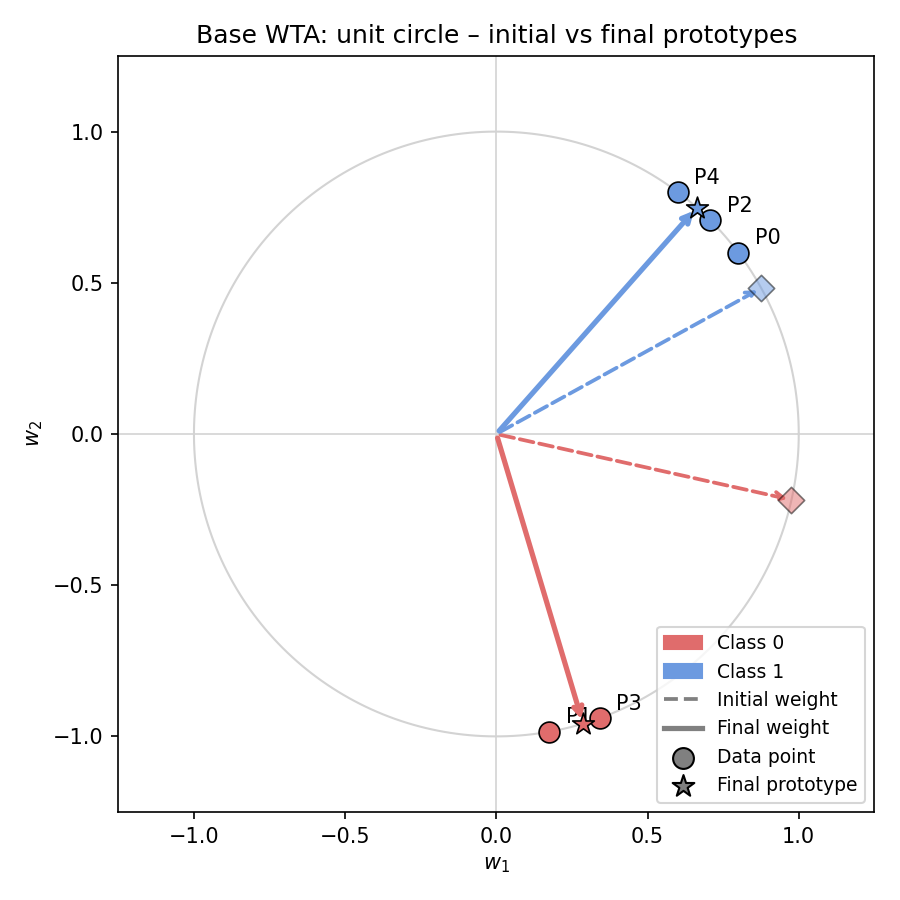
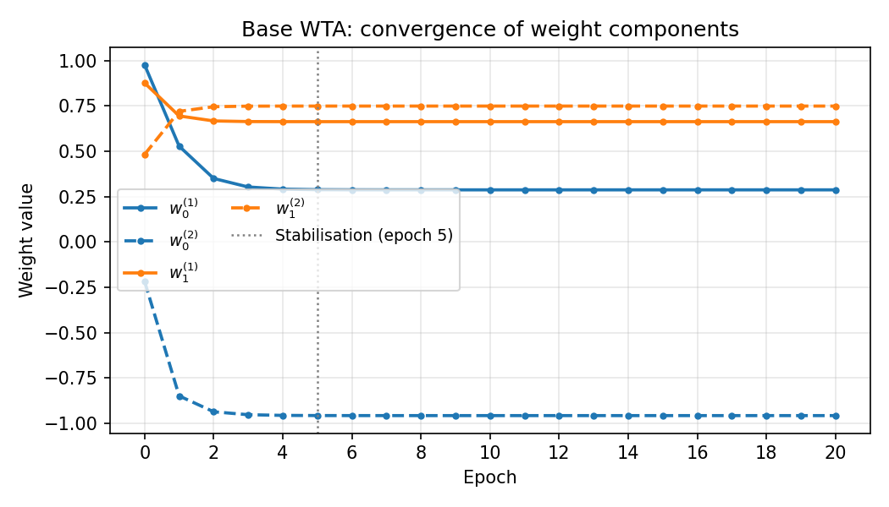
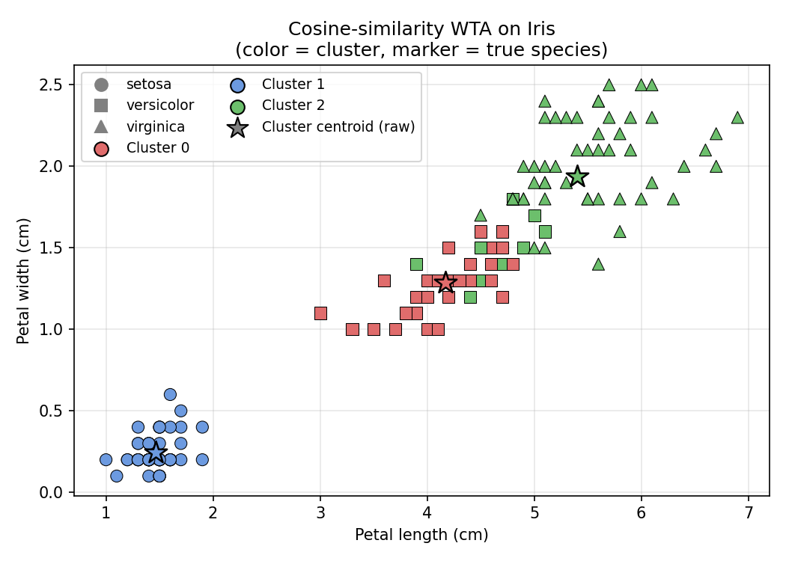
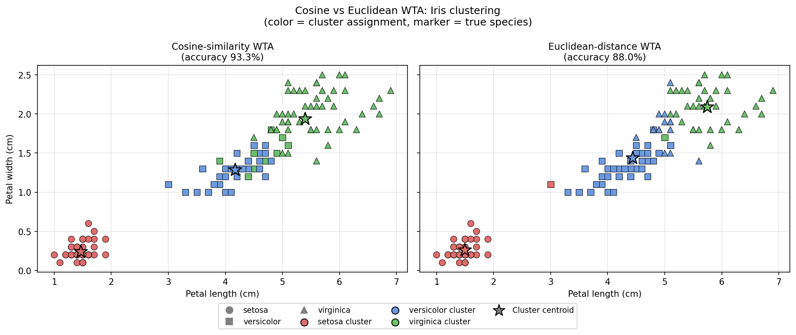

# CSA01 - Team Project 4, Part 1: Winner-Take-All (Kohonen) Network

**Course:** Neural Networks (CSA01)  
**Team Members:**
- SATO Sho (m5301059)
- USAMI Yuki (m5301073)
- SEKINE Kento (m5301060)
- AIZAWA Yuma (m5301001)
- WATABE Chitose (m5301074)

---

## a) Problem Description

This project deals with **unsupervised competitive learning** using a Winner-Take-All (WTA) network, also known as a Kohonen network.

The goal is to find a small set of representative weight vectors (prototypes) that cover the distribution of training patterns.
Unlike supervised learning, no class labels are used — the network picks up structure from the data on its own.

We worked on two problems.

**Base experiment** (`kohonen_network.c`)  
Five 2D unit vectors placed on the unit circle are clustered into M = 2 groups.
Since the inputs are unit-norm and the winner is selected by inner product, this is geometrically equivalent to finding the two points on the unit circle that best represent the directions of the data.

**Iris dataset experiment** (`kohonen_network_iris.c`)  
The Iris dataset (Fisher, 1936) contains 150 samples from three species of iris flowers.
Each sample has four measurements: sepal length, sepal width, petal length, and petal width.
We train a WTA network with M = 3 neurons to see whether unsupervised learning can recover the three species without using the ground-truth labels.

---

## b) Method and Implementation

### Winner-Take-All Algorithm

The network has M output neurons, each with a weight vector $\boldsymbol{w}_m \in \mathbb{R}^I$.
On each training step, one input $\boldsymbol{x}^{(p)}$ is presented and the winning neuron $m^*$ is selected by the largest inner product:

$$m^* = \underset{m}{\arg\max} \ \boldsymbol{w}_m^\top \boldsymbol{x}^{(p)}$$

Only the winning neuron's weight vector is updated:

$$\boldsymbol{w}_{m^*} \leftarrow \boldsymbol{w}_{m^*} + \alpha \left(\boldsymbol{x}^{(p)} - \boldsymbol{w}_{m^*}\right), \quad \alpha = 0.5$$

After each update, the weight vector is re-normalized to unit length so that it stays on the unit hypersphere:

$$\boldsymbol{w}_{m^*} \leftarrow \frac{\boldsymbol{w}_{m^*}}{\|\boldsymbol{w}_{m^*}\|}$$

When both weights and inputs are unit-norm, the inner product equals the cosine similarity, so the winner is effectively the neuron whose prototype *direction* is most aligned with the input.

### Input Preprocessing

For the Iris experiment, all input vectors are L2-normalized before training:

$$\boldsymbol{x}^{(p)} \leftarrow \frac{\boldsymbol{x}^{(p)}}{\|\boldsymbol{x}^{(p)}\|}$$

This is necessary because the WTA criterion is based on inner product.
Without normalization, the dot product is dominated by the overall magnitude of the feature vector rather than its direction, which biases the winner selection toward samples with large feature values.

### Implementation

The base program uses five pre-defined unit vectors:

```c
double x[P][I] = {
    {0.8,    0.6   },
    {0.1736, -0.9848},
    {0.707,  0.707 },
    {0.342,  -0.9397},
    {0.6,    0.8   }};
```

The Iris program reads features from `iris.data`, discards the species label column, and applies L2 normalization:

```c
for (int p = 0; p < P; p++) {
    double n = 0;
    for (int j = 0; j < I; j++) n += x[p][j] * x[p][j];
    n = sqrt(n);
    for (int j = 0; j < I; j++) x[p][j] /= n;
}
```

### Bugs Found and Fixed

The original `kohonen_network_iris.c` had two problems that caused all 150 patterns to be assigned to class 0.

**Bug 1 — Winner initialization with `s0 = 0`**

```c
/* Original (wrong) */
s0 = 0;

/* Fixed */
s0 = -1e9;
```

With `s0 = 0`, a neuron can only win if its inner product with the input is strictly positive.
All Iris feature values are positive, so after L2 normalization all input vectors lie in the **positive orthant** of 4D space.
If a neuron's weight vector has negative components, its inner products with all inputs are negative — it can never win.
Once neuron 0 monopolizes the first few patterns and moves toward the centroid, neurons 1 and 2 become permanently excluded (**dead neuron problem**).
Setting `s0 = -1e9` ensures the true maximum inner product is always found regardless of sign.

**Bug 2 — Weight initialization outside the data region**

```c
/* Original (wrong) */
w[m][i] = (double)(rand() % 10001) / 10000.0 - 0.5;  /* in [-0.5, 0.5] */
norm = ...; w[m][i] /= norm;

/* Fixed */
int rp = (rand() % P);
for (i = 0; i < I; i++) w[m][i] = x[rp][i];
```

Random initialization in $[-0.5, 0.5]^4$ (then normalized) places weight vectors across the entire unit hypersphere.
For Iris data (all-positive orthant), about half of those neurons start pointing in directions with negative components, giving them systematically lower inner products for all training samples.
Even with the `s0` fix, one neuron tends to dominate early training and drives the others to dead states.
Picking initial weights from training samples means every neuron starts somewhere inside the real data distribution, so none is at a systematic disadvantage from the first epoch.

---

## c) Simulation Results and Discussion

### Base Experiment

After 20 training epochs, the two weight vectors converge to:

| Neuron | $w_1$ | $w_2$ |
|:------:|:-----:|:-----:|
| 0 | 0.2868 | −0.9580 |
| 1 | 0.6628 | 0.7488  |

Classification result:

| Pattern | Coordinates | Assigned class |
|:-------:|:-----------:|:--------------:|
| 0 | (0.800,  0.600)  | 1 |
| 1 | (0.174, −0.985)  | 0 |
| 2 | (0.707,  0.707)  | 1 |
| 3 | (0.342, −0.940)  | 0 |
| 4 | (0.600,  0.800)  | 1 |

Figure 1 shows the unit circle with the five data points, the initial weight vectors (dashed arrows), and the final converged prototypes (solid arrows with stars).
The two neurons start at random positions on the circle and migrate toward the centroids of the two natural clusters (upper and lower halves).



Figure 2 shows how the four weight components evolve over 20 epochs.
All components reach their stable values by around epoch 5, with no visible change afterwards.



The result is geometrically clean: both neurons land at the centroids of the two obvious clusters on the unit circle.

### Iris Experiment

Classification results against the ground-truth species (patterns 0–49: *setosa*, 50–99: *versicolor*, 100–149: *virginica*):

| Species    | Class 0 | Class 1 | Class 2 |
|:----------:|:-------:|:-------:|:-------:|
| setosa     | 50      | 0       | 0       |
| versicolor | 0       | 40      | 10      |
| virginica  | 0       | 0       | 50      |

**Overall accuracy: 140/150 = 93.3%** (without using any label information)

The final prototype weight vectors (L2-normalized):

| Neuron | sepal length | sepal width | petal length | petal width |
|:------:|:------------:|:-----------:|:------------:|:-----------:|
| 0 | 0.804 | 0.546 | 0.232 | 0.034 |
| 1 | 0.768 | 0.369 | 0.496 | 0.165 |
| 2 | 0.694 | 0.348 | 0.589 | 0.225 |

Figure 3 shows the clustering result projected onto the petal length–petal width plane.
The color encodes the cluster assignment (red = cluster 0 / setosa, blue = cluster 1 / versicolor, green = cluster 2 / virginica), and the marker shape encodes the true species (circle, square, triangle).
Stars mark the cluster centroids in raw feature space.



*Setosa* and *virginica* are both perfectly classified.
The 10 misclassified samples are all from *versicolor*, which ended up assigned to the *virginica* cluster.
This is visible in Figure 3 as green squares in the upper-right region.
*Setosa* is known to be linearly separable from the other two species, while *versicolor* and *virginica* have overlapping petal distributions — so this outcome is not surprising.

Looking at the prototype components, neuron 0 (setosa) has a high sepal-to-petal ratio (large sepal width 0.546, tiny petal length 0.232 and petal width 0.034 relative to the total norm), which reflects setosa's characteristic of small petals relative to body size.
Neurons 1 and 2 differ mainly in the petal component (0.496 vs 0.589), reflecting the gradual increase in petal size from versicolor to virginica.

---

## d) New Problem: Does the Winner Criterion Affect Clustering Quality?

### Motivation

The base WTA program selects winners by cosine similarity (inner product with L2-normalized inputs).
This criterion treats all samples as direction vectors on the unit hypersphere and ignores magnitude.
An alternative is to use **Euclidean distance** as the winner criterion, which corresponds to standard k-means clustering and takes absolute feature magnitudes into account.

The question we posed is: which criterion better separates the three Iris species?

The two approaches differ in what they assume about the data:

- **Cosine similarity WTA** — clusters samples by the *ratio* of features (e.g., petal length relative to sepal length). L2 normalization is mandatory.
- **Euclidean distance WTA** — clusters samples by the *absolute* feature values. No normalization needed.

For the Iris dataset, the three species differ both in feature ratios and in absolute scale (virginica has the largest petals, setosa the smallest), so it is not clear in advance which criterion would give better clusters.

---

## e) Modification: Euclidean-Distance WTA

We implemented a variant of the WTA network in `Practice/kohonen_euclidean.c` that uses squared Euclidean distance for winner selection, without L2-normalizing the inputs:

$$m^* = \underset{m}{\arg\min} \|\boldsymbol{x}^{(p)} - \boldsymbol{w}_m\|^2$$

The weight update rule remains the same, but re-normalization is removed since the weights are now prototypes in the original (unnormalized) feature space:

$$\boldsymbol{w}_{m^*} \leftarrow \boldsymbol{w}_{m^*} + \alpha \left(\boldsymbol{x}^{(p)} - \boldsymbol{w}_{m^*}\right)$$

Because the Euclidean WTA moves weights more slowly toward distant clusters, we reduced the learning rate to $\alpha = 0.1$ and increased training epochs to 50 for a fair comparison.

The implementation of the winner search loop:

```c
dist0 = 1e18;
for (m = 0; m < M; m++) {
    dist = 0;
    for (i = 0; i < I; i++)
        dist += (w[m][i] - x[p][i]) * (w[m][i] - x[p][i]);
    if (dist < dist0) { dist0 = dist; m0 = m; }
}
```

The initialization (random training samples) is the same in both versions, since it works well regardless of which distance criterion is used.

---

## f) New Simulation: Comparison of Cosine vs Euclidean WTA

### Results

**Euclidean distance WTA** confusion table:

| Species    | Class 0 | Class 1 | Class 2 |
|:----------:|:-------:|:-------:|:-------:|
| setosa     | 0       | 50      | 0       |
| versicolor | 47      | 1       | 2       |
| virginica  | 15      | 0       | 35      |

**Overall accuracy: 132/150 = 88.0%**

Final prototypes (in original feature units, cm):

| Neuron | sepal length | sepal width | petal length | petal width |
|:------:|:------------:|:-----------:|:------------:|:-----------:|
| 0 | 5.93 | 2.74 | 4.78 | 1.64 |
| 1 | 4.96 | 3.38 | 1.47 | 0.25 |
| 2 | 6.76 | 3.13 | 5.60 | 2.19 |

### Comparison

| Criterion | Accuracy | Setosa | Versicolor | Virginica |
|:---------:|:--------:|:------:|:----------:|:---------:|
| Cosine similarity WTA (L2-normalized) | **93.3%** | 100% | 80% | 100% |
| Euclidean distance WTA (raw features) | 88.0% | 100% | **94%** | 70% |

Figure 4 shows the clustering results of both methods side by side on the petal length–petal width plane.
Colors represent cluster assignments, and marker shapes represent the true species.
The misclassified samples are visible as "wrong-colored" markers: green squares (versicolor classified as virginica cluster) in the cosine WTA, and blue triangles (virginica classified as versicolor cluster) in the Euclidean WTA.



Both methods perfectly classify *setosa*, which is well-separated from the other two species in any feature representation.
The results diverge on *versicolor* and *virginica*.

The cosine WTA classifies all 50 *virginica* correctly but misclassifies 10 *versicolor* as *virginica*.
The Euclidean WTA does the opposite: it classifies 47/50 *versicolor* correctly but misclassifies 15/50 *virginica* as the versicolor cluster.
In Figure 4, this appears as a cluster boundary that shifts rightward in the Euclidean case, absorbing part of the *virginica* population into the versicolor cluster.

### Discussion

The underlying reason is how each criterion perceives the similarity between versicolor and virginica.

In raw feature space, *virginica* has larger absolute values for all features (longer petals, longer sepals).
The Euclidean distance between a virginica sample and the versicolor centroid can be small if the overall size difference is moderate, causing those samples to be pulled into the versicolor cluster.
As a result, the versicolor prototype "absorbs" part of the virginica population, and the virginica prototype ends up representing only the most distinctly large-flowered samples (35/50).

After L2 normalization, the feature *ratios* become the discriminating signal rather than the absolute values.
Virginica tends to have proportionally larger petals relative to sepals compared to versicolor.
This directional difference is more clearly captured in cosine space, allowing the cosine WTA to separate virginica perfectly.

Put simply, cosine WTA compares the *shape* of feature vectors (their ratios), while Euclidean WTA compares their *size* (absolute values).
For the Iris dataset, the key difference between versicolor and virginica is in the *proportion* of petal size relative to the whole flower, not in overall body size, so the cosine criterion fits the data better and gives higher accuracy (93.3% vs 88.0%).

What this comparison shows is that the choice of distance metric is not just an implementation detail — it reflects which aspect of the data we think matters.
When the important signal lies in the shape of a feature vector (i.e., the ratio of its components) rather than its overall magnitude, normalizing inputs and using cosine similarity makes more sense than using raw Euclidean distance.
